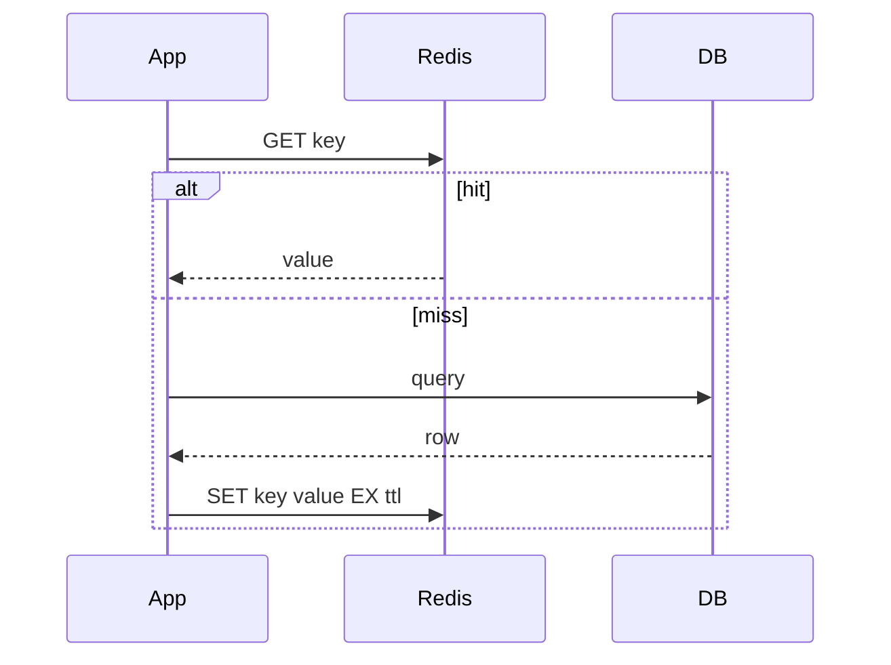

## Why this matters

Caching is how you keep p99 down — and how you serve stale money if you’re careless. Interviewers want patterns + failure modes.

## Definitions

- **Cache-aside:** App reads cache first; on miss loads DB then populates cache (lazy loading) — safe default for most services.
- **TTL (time to live):** How long a cache entry stays valid before expiry forces a refresh.
- **Cache stampede:** Many concurrent misses for one expired hot key all hit the origin to rebuild it.
- **Write-through:** Cache is updated synchronously on every DB write (stronger freshness, more write latency).
- **Write-behind:** Cache accepts writes and flushes to DB asynchronously — lower latency, weaker durability.
- **Cache invalidation:** Explicit delete/update of a key after a write so readers don’t keep serving stale data.
- **Negative cache:** Short-TTL cache of “not found”/error so repeated misses don’t hammer the origin.

## Redis roles

- Cache (strings/hashes)  
- Rate limits / counters  
- Distributed locks (carefully)  
- Pub/Sub or streams for realtime  
- Session store

## Cache-aside (lazy loading)



```java
String getUser(String id) {
  String key = "user:" + id;
  String cached = redis.get(key);
  if (cached != null) return cached;
  String val = db.findUserJson(id);
  if (val != null) redis.setEx(key, 300, val);
  return val;
}
```

```csharp
async Task<string?> GetUserAsync(string id) {
  var key = $"user:{id}";
  var cached = await redis.StringGetAsync(key);
  if (!cached.IsNullOrEmpty) return cached!;
  var val = await db.FindUserJsonAsync(id);
  if (val is not null) await redis.StringSetAsync(key, val, TimeSpan.FromMinutes(5));
  return val;
}
```

## Write paths

| Pattern | Idea |
|---------|------|
| Cache-aside | App writes DB, deletes/updates cache |
| Read-through | Cache loader fetches DB |
| Write-through | Cache writes DB synchronously |
| Write-behind | Cache buffers writes (riskier) |

**Safe default:** update DB, **delete** cache key (next read rebuilds).

## Stampede control

When a hot key expires, many requests miss together:

- Soft TTL / early refresh  
- Singleflight / lock around rebuild  
- Probabilistic expiration

## Consistency talking points

- Cached data is **eventually consistent** with DB  
- For passwords/permissions, short TTL or explicit invalidation  
- Never cache errors forever — bound negative cache TTL

## Interview Q&A

- **Q:** Redis vs Memcached?
  **A:** Redis richer data structures + persistence options; Memcached simple distributed RAM cache.
- **Q:** Is Redis a source of truth?
  **A:** Usually no for core business data; yes for ephemeral presence/rate limits with eyes open.
- **Q:** Hot key?
  **A:** Replicate locally, split key, or edge cache.

## Pitfalls

- Huge values bloating Redis memory  
- Using Redis lock without expiry (deadlock on crash)  
- Double-write DB+cache without invalidation strategy

## 60-second answer

“I use cache-aside with short TTLs and delete-on-write invalidation. Redis is great for hot reads, counters, and presence. I design for stampedes and treat cache as an accelerator, not the system of record.”

## Further study

- [Redis documentation](https://redis.io/docs/latest/) — canonical reference for data types, commands, and deployment modes
- [Key eviction](https://redis.io/docs/latest/develop/reference/eviction/) — what happens when memory is full (`maxmemory` policies)
- [Redis persistence](https://redis.io/docs/latest/operate/oss_and_stack/management/persistence/) — RDB/AOF trade-offs when Redis is more than a pure cache
- [Redis transactions](https://redis.io/docs/latest/develop/interact/transactions/) — `MULTI`/`EXEC` atomicity limits vs database ACID

## Practice prompts

1. Design cache keys for multi-tenant settings  
2. Invalidate a user’s cached permissions on role change  
3. Estimate memory for 10M session blobs
