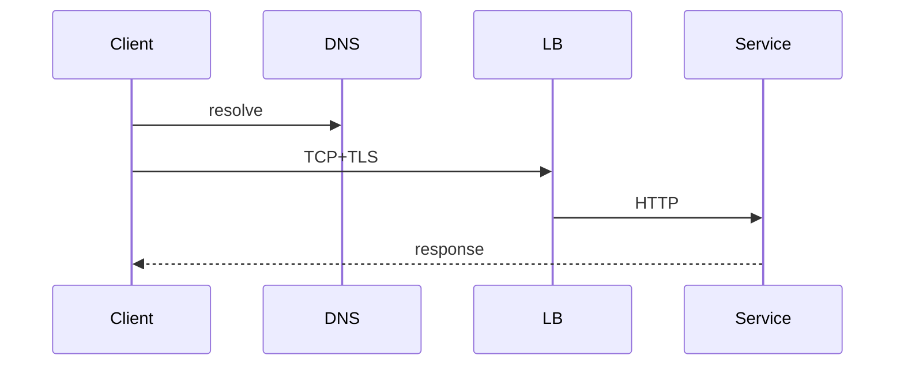

## Why this matters

Debugging production “flaky API” issues requires knowing which layer failed — DNS, TCP, TLS, app, or idle timeout.

## Definitions

- **HTTP request lifecycle:** End-to-end path: DNS → TCP connect → TLS handshake → HTTP request/response (often with connection reuse).
- **Idempotent method:** Safe to retry with the same effect as one call (`GET`/`PUT`/`DELETE`; `POST` needs extra keys).
- **Idempotency-Key:** Client token the server stores so mutating retries return the original result instead of double side effects.
- **Keep-alive:** Reuse a TCP connection for multiple HTTP requests to avoid repeated connect/TLS cost.
- **HTTP/2 multiplexing:** Many independent streams on one connection so requests don’t block each other at the HTTP layer.
- **Connect timeout:** Max time to establish TCP (and often TLS) before the client aborts.
- **Idle timeout:** How long a pooled/LB connection may sit unused before it is closed (common cause of flaky 502/504s).
- **TLS termination:** Decrypt HTTPS at a proxy/LB; the next hop may see plain HTTP unless re-encrypted or mTLS is used.

## Full path



1. DNS resolve (cache TTLs matter)  
2. TCP connect (+ TLS handshake)  
3. HTTP request/response  
4. Connection reuse (keep-alive, HTTP/2 multiplex)

## HTTP semantics you must know

| Method | Safe | Idempotent | Typical use |
|--------|------|------------|-------------|
| GET | yes | yes | Read |
| PUT | no | yes | Replace by id |
| DELETE | no | yes | Delete |
| POST | no | no* | Create/actions |

\*Make POST idempotent with `Idempotency-Key` when clients retry.

## Status codes (interview set)

- `200/201/204`, `301/302/304`  
- `400/401/403/404/409/429`  
- `500/502/503/504` — distinguish gateway vs app

## Timeouts (draw this)

- Connect timeout  
- TLS handshake timeout  
- Request/response (socket read) timeout  
- Idle connection timeout in pools/LB

Mismatch → mysterious `503`/`IOException` under load.

## Worked example — idempotent payment

```http
POST /payments
Idempotency-Key: 8f3c-...
Content-Type: application/json

{"orderId":"o1","amount":1099}
```

Server stores key → result; retries return the same response.

```java
// pseudo
Result pay(String key, PayCmd cmd) {
  return idempotencyStore.getOrCompute(key, () -> processor.charge(cmd));
}
```

```csharp
// pseudo
Task<Result> PayAsync(string key, PayCmd cmd) =>
  store.GetOrComputeAsync(key, () => processor.ChargeAsync(cmd));
```

## HTTP/2 and HTTP/3 (talking points)

- H2: multiplex streams on one connection; header compression  
- Still TCP HOL blocking  
- H3/QUIC: UDP-based, improves lossy networks

## Interview Q&A

- **Q:** Where does TLS terminate?
  **A:** Often at LB/CDN; service may see HTTP internally — discuss trust & mTLS for service-to-service.
- **Q:** Why is POST retried dangerous?
  **A:** Double charge; need idempotency keys or exactly-once business logic.
- **Q:** Connection pool exhaustion?
  **A:** Slow backends + large pools → pileups; use bounded pools, timeouts, circuit breakers.

## Pitfalls

- Infinite retries without jitter  
- Caching `Authorization` responses incorrectly  
- Ignoring `Expect: 100-continue` / large upload edge cases

## 60-second answer

“A call is DNS, TCP/TLS, then HTTP. I design timeouts at each layer, use idempotency for mutating retries, and pick status codes that guide clients. HTTP/2 helps multiplexing; I’d still protect backends with pools and limits.”

## Further study

- [HTTP overview (MDN)](https://developer.mozilla.org/en-US/docs/Web/HTTP/Overview) — end-to-end HTTP model clients and servers share
- [HTTP response status codes (MDN)](https://developer.mozilla.org/en-US/docs/Web/HTTP/Status) — status semantics for API design and debugging
- [TLS (MDN Glossary)](https://developer.mozilla.org/en-US/docs/Glossary/TLS) — where encryption sits in the request path
- [RFC 9110 — HTTP Semantics](https://www.rfc-editor.org/rfc/rfc9110.html) — authoritative method/idempotency/status rules

## Practice prompts

1. Trace a 504 from browser to pod  
2. Design retry policy for GET vs POST  
3. Explain cookie vs bearer token transport
