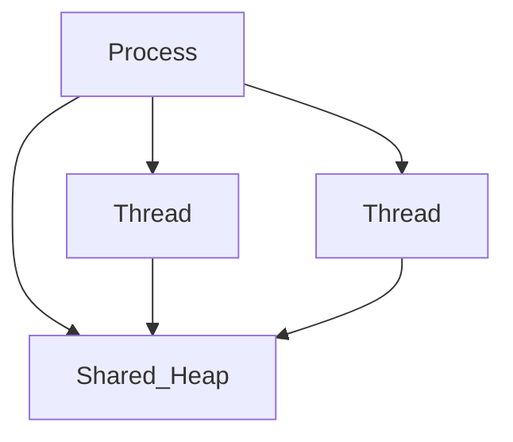

## Why this matters

Backend performance bugs often come from blocking thread pools or sharing mutable state across threads. Interviewers link OS concepts to your runtime (JVM / .NET).

## Definitions

- **Process:** OS execution unit with its own address space and strong isolation from other processes.
- **Thread:** Schedulable execution unit that **shares** the process heap/address space with sibling threads.
- **Address space:** Virtual memory layout a process sees; shared by its threads, not by other processes.
- **Context switch:** Save/restore CPU registers and scheduling state when the OS switches threads — not free.
- **Thread pool:** Bounded workers that run queued tasks instead of creating a new thread per request.
- **Async I/O:** Non-blocking I/O that releases a worker while waiting on network/disk, raising concurrency.
- **Race condition:** Incorrect behavior that depends on timing of concurrent access to shared mutable state.
- **IPC:** How separate processes exchange data (sockets, pipes, shared memory, messages) without a shared heap.

## Concept

| | Process | Thread |
|---|---------|--------|
| Address space | Own | Shared within process |
| Isolation | Strong | Weak (races) |
| Create cost | Higher | Lower |
| Communication | IPC, sockets | Shared memory + sync |

CPU schedules threads (kernel threads). Runtimes multiplex many tasks onto pools.



## Worked example — don’t spawn unbounded threads

```java
// Bad: new Thread per request
// Better:
ExecutorService pool = Executors.newFixedThreadPool(16);
pool.submit(() -> handle(req));
```

```csharp
// Bad: new Thread per request
// Better: async I/O or Task.Run for CPU work sparingly
await ProcessAsync(req); // frees thread on I/O awaits
```

## Async vs threads

- **Blocking I/O** holds a worker thread  
- **Async I/O** releases the worker while waiting → higher concurrency with fewer threads  
- CPU-bound work still needs threads/cores; async won’t magically parallelize pure CPU

## Context switch cost

Not free. Thrashing pools (too many threads) → more switching, worse latency. Prefer bounded pools + queues + backpressure.

## Interview Q&A

- **Q:** Process vs container?
  **A:** Container isolates processes with cgroups/namespaces; still usually one main app process (+ sidecars).
- **Q:** Green threads?
  **A:** User-space scheduled tasks (goroutines conceptually); JVM virtual threads / .NET tasks similar idea at different layers.
- **Q:** How many threads for a web app?
  **A:** Roughly related to cores for CPU work; for I/O-bound async apps, fewer threads can serve more connections.

## Pitfalls

- `CachedThreadPool` / unbounded growth under spike  
- Sharing mutable collections without sync  
- Blocking async context (see .NET async lesson)

## 60-second answer

“Processes isolate address spaces; threads share heap and need synchronization. In services I use bounded pools and async I/O so we don’t burn threads waiting on network. Scheduling and context switches make ‘just add threads’ a bad scalability plan.”

## Further study

- [Process (Wikipedia)](https://en.wikipedia.org/wiki/Process_(computing)) — isolation, address spaces, and OS process model
- [Thread (Wikipedia)](https://en.wikipedia.org/wiki/Thread_(computing)) — shared-memory concurrency foundations
- [Java Thread API](https://docs.oracle.com/en/java/javase/21/docs/api/java.base/java/lang/Thread.html) — how JVM threads map to OS concepts
- [Threads and threading (.NET)](https://learn.microsoft.com/en-us/dotnet/standard/threading/threads-and-threading) — managed threading model interviewers expect

## Practice prompts

1. Diagnose thread-pool starvation symptoms  
2. Compare multiprocess workers vs multithreaded server  
3. Explain false sharing at a high level
