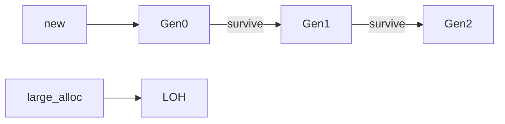

## Why this matters

Senior .NET interviews often ask how the GC works at a practical level: generations, allocation pressure, LOH, and how you’d diagnose a leak. You need a clear story without claiming to be a runtime engineer.

## Definitions

- **Generational GC:** Collects short-lived objects (Gen0/Gen1) far more often than long-lived ones (Gen2).
- **Gen0:** Youngest generation where new objects start; collected most frequently.
- **LOH (Large Object Heap):** Segment for large allocations (historically ≥85KB), collected with Gen2 — fragmentation risk.
- **Server GC:** Multi-heap mode optimized for multi-core server apps (typical ASP.NET default on servers).
- **Allocation pressure:** High rates of short-lived allocations that force more frequent GCs and raise pauses/CPU.
- **ArrayPool<T>:** Shared pool for renting/returning temporary arrays to cut allocation and GC churn.
- **Span<T>:** Stack-only view over contiguous memory for allocation-free slicing and parsing.
- **IDisposable:** Deterministic cleanup for unmanaged/scarce resources; GC finalizers are a last resort, not the plan.

## Concept

### Managed heap sketch

.NET GC is generational:

- **Gen0** — short-lived objects (collected frequently)  
- **Gen1** — intermediate  
- **Gen2** — long-lived  
- **LOH** (Large Object Heap) — large allocations (historically ≥85KB), collected with Gen2  



### Workstation vs Server GC

| Mode | Typical use |
|------|-------------|
| Workstation | Client apps; lower footprint |
| Server | ASP.NET / services; per-heap segments on multi-core |

In containers, know **GC heap hard limits** / server GC interaction with cgroup memory — modern runtimes are container-aware, but sizing still matters.

### What creates pressure

- High allocation rate → more GC frequency  
- Mid-life / long-lived accidental retention → Gen2 growth  
- Large temporary arrays → LOH fragmentation / Gen2 cost  
- Pinning / native interop holding managed objects  

## Worked example 1 — Reduce allocations in hot paths

```csharp
// Prefer Span-based parsing over splitting strings
static bool TryReadId(ReadOnlySpan<char> line, out int id)
{
    id = 0;
    var comma = line.IndexOf(',');
    if (comma <= 0) return false;
    return int.TryParse(line[..comma], out id);
}
```

```csharp
// String concatenation in loops → StringBuilder
var sb = new StringBuilder();
foreach (var part in parts) sb.Append(part);
```

## Worked example 2 — ArrayPool for temporary buffers

```csharp
byte[] buffer = ArrayPool<byte>.Shared.Rent(4096);
try
{
    int read = await stream.ReadAsync(buffer.AsMemory(0, 4096), ct);
    // use buffer[..read]
}
finally
{
    ArrayPool<byte>.Shared.Return(buffer);
}
```

Don’t return a rented buffer that still escapes to callers.

## Worked example 3 — Accidental retention (leak story)

```csharp
// Static cache without bounds — classic "leak"
public static class Cache
{
    public static ConcurrentDictionary<string, byte[]> Data { get; } = new();
}

// Better: size limit + TTL (MemoryCache / hybrid cache)
services.AddMemoryCache();
```

Interview narrative: “If Gen2 grows under steady load and dumps show a static dictionary dominating, we have unbounded retention — not a GC bug.”

## Worked example 4 — Diagnosis toolkit

```bash
# dump + analyze
dotnet-dump collect -p <pid>
dotnet-dump analyze <dump>
> dumpheap -stat
> gcroot <address>
```

Also: `dotnet-counters` (GC heap size, allocation rate), Application Insights / OpenTelemetry metrics, PerfView / Visual Studio diagnostic session, `GC.GetTotalMemory`, event counters for Gen0/1/2 collections.

## Tuning notes (humble)

- Fix allocation churn and leaks before exotic GC flags  
- Prefer fewer large temporary allocations on hot paths  
- Consider `GCSettings.LatencyMode` only with measurement  
- In K8s, set memory limits/requests coherently with heap usage  
- `IDisposable` / `await using` for unmanaged and scarce resources — GC is not a substitute for prompt cleanup of handles  

## Interview Q&A

- **Q:** Stack vs heap in .NET?  
  **A:** Value types may live on the stack or inline; reference types on the heap. Boxing moves value types to the heap.
- **Q:** What is the LOH?  
  **A:** Heap for large objects; collected with Gen2; historically more fragmentation-sensitive — avoid short-lived huge arrays in hot loops.
- **Q:** Server vs workstation GC?  
  **A:** Server optimizes throughput on multi-core servers; workstation for clients. Services usually server GC.
- **Q:** How do you prove a managed memory leak?  
  **A:** Steady RPS but rising Gen2/heap; dump → `dumpheap -stat` → `gcroot` to a static/event handler/cache.
- **Q:** Does `Dispose` free managed memory immediately?  
  **A:** No — it releases unmanaged/scarce resources; managed memory waits for GC (finalizers complicate things).
- **Q:** When Span helps?  
  **A:** Slicing/parsing without allocating substrings or arrays.

## Pitfalls

- Unbounded static caches  
- Allocating large arrays per request  
- Forgetting to return pooled arrays  
- Event handler leaks (`+=` without `-=`)  
- Boxing in generic numeric hot paths  
- Blaming GC for slow SQL without traces  
- Finalizer-dependent cleanup instead of `Dispose`

## 60-second answer

“ .NET GC is generational: most objects die in Gen0; survivors promote; large objects go to LOH. I reduce allocation pressure with Span and pooling, bound caches, and dispose scarce resources. To diagnose, I watch allocation/heap counters and use dumps — gcroot usually points to a static cache or forgotten subscription, not a broken GC.”

## Further study

- [.NET garbage collection](https://learn.microsoft.com/en-us/dotnet/standard/garbage-collection/) — generations, modes, and fundamentals
- [Fundamentals of garbage collection](https://learn.microsoft.com/en-us/dotnet/standard/garbage-collection/fundamentals) — ephemeral segments, SOH vs LOH
- [Span<T>](https://learn.microsoft.com/en-us/dotnet/api/system.span-1) — allocation-free memory views
- [ArrayPool<T>](https://learn.microsoft.com/en-us/dotnet/api/system.buffers.arraypool-1) — rent/return patterns for hot paths

## Practice prompts

1. Interpret rising Gen2 under constant traffic — list top three hypotheses  
2. Refactor a hot string-split parser to `ReadOnlySpan<char>`  
3. Design a bounded memory cache with eviction for per-user blobs  
4. Explain a LOH-related performance regression from large per-request buffers
