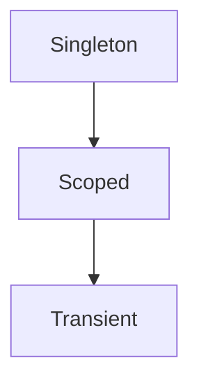

## Why this matters

DI and middleware are the skeleton of every ASP.NET Core app. Interviews love **lifetime bugs** (captive dependencies) and **middleware order** mistakes that break auth or exception handling.

## Definitions

- **Transient:** New instance every time the service is resolved — fine for lightweight, stateless helpers.
- **Scoped:** One instance per request/scope — correct lifetime for `DbContext` and most per-request state.
- **Singleton:** One shared instance for the app lifetime — must be thread-safe and never captive shorter deps.
- **Captive dependency:** Longer-lived service incorrectly holding a shorter-lived dependency (singleton → scoped).
- **Middleware pipeline:** Ordered HTTP component chain; registration order controls auth, exception handling, routing.
- **IHttpClientFactory:** Preferred way to create `HttpClient` with correct lifetime, handlers, and DNS refresh.
- **Options pattern:** Typed configuration via `IOptions<T>` / `IOptionsMonitor<T>` instead of scattering raw config reads.

## Concept

### DI lifetimes

| Lifetime | Instance scope | Use |
|----------|----------------|-----|
| **Transient** | New each injection | Lightweight, stateless helpers |
| **Scoped** | Once per request/scope | `DbContext`, per-request unit of work |
| **Singleton** | App lifetime | Thread-safe shared services, options |



**Rule:** a longer-lived service must not depend on a shorter-lived one (singleton → scoped is the classic **captive dependency**).

### Middleware

Middleware forms a pipeline: each component can run logic before and after the next delegate.

```csharp
app.Use(async (ctx, next) =>
{
    // before
    await next();
    // after
});
```

Order is critical:

1. Exception handling  
2. HTTPS redirection / HSTS (as appropriate)  
3. Routing  
4. CORS (when used)  
5. Authentication  
6. Authorization  
7. Endpoints  

## Worked example 1 — Registering services

```csharp
builder.Services.AddSingleton<IClock, SystemClock>();
builder.Services.AddScoped<IOrderService, OrderService>();
builder.Services.AddScoped<AppDb>(); // via AddDbContext
builder.Services.AddHttpClient<IPaymentClient, PaymentClient>(c =>
{
    c.BaseAddress = new Uri("https://payments.example");
    c.Timeout = TimeSpan.FromSeconds(2);
});
```

Prefer `IHttpClientFactory` over long-lived raw `HttpClient` anti-patterns (DNS/socket issues) or per-call `new HttpClient()` churn.

## Worked example 2 — Captive dependency bug

```csharp
// BUG: singleton holds scoped DbContext forever
builder.Services.AddSingleton<ReportService>();
builder.Services.AddDbContext<AppDb>(...);

public sealed class ReportService(AppDb db) // captive!
{
    public Task<int> CountAsync() => db.Orders.CountAsync();
}
```

**Fixes:**
- Make `ReportService` scoped, or  
- Inject `IServiceScopeFactory` and create a scope per operation, or  
- Don’t take `DbContext` in a singleton  

```csharp
public sealed class ReportService(IServiceScopeFactory scopes)
{
    public async Task<int> CountAsync(CancellationToken ct)
    {
        await using var scope = scopes.CreateAsyncScope();
        var db = scope.ServiceProvider.GetRequiredService<AppDb>();
        return await db.Orders.CountAsync(ct);
    }
}
```

## Worked example 3 — Custom middleware

```csharp
public sealed class CorrelationIdMiddleware(RequestDelegate next)
{
    public async Task InvokeAsync(HttpContext ctx)
    {
        var cid = ctx.Request.Headers["X-Correlation-Id"].FirstOrDefault()
                  ?? Guid.NewGuid().ToString("n");
        ctx.Response.Headers["X-Correlation-Id"] = cid;
        using (ctx.RequestServices.GetRequiredService<ILoggerFactory>()
            .CreateLogger("Request")
            .BeginScope(new Dictionary<string, object> { ["CorrelationId"] = cid }))
        {
            await next(ctx);
        }
    }
}

app.UseMiddleware<CorrelationIdMiddleware>();
```

Middleware constructor gets singletons; scoped services should be injected into `InvokeAsync` parameters.

```csharp
public async Task InvokeAsync(HttpContext ctx, AppDb db) // scoped OK here
{
    await next(ctx);
}
```

## Worked example 4 — Pipeline order

```csharp
var app = builder.Build();

app.UseExceptionHandler("/error");
app.UseRouting();
app.UseAuthentication();
app.UseAuthorization();
app.MapControllers();
```

If `UseAuthorization` runs before `UseAuthentication`, identity is missing. If exception middleware is too late, errors bypass it.

## Options pattern

```csharp
builder.Services.Configure<PaymentOptions>(
    builder.Configuration.GetSection("Payments"));

public sealed class PaymentClient(IOptions<PaymentOptions> options)
{
    private readonly string _key = options.Value.ApiKey;
}
```

Use `IOptionsMonitor` when settings can reload; never inject naked `IConfiguration` everywhere if a typed options class is clearer.

## Interview Q&A

- **Q:** Why is `DbContext` scoped?  
  **A:** One unit-of-work / change tracker per request; safe disposal at request end.
- **Q:** What is a captive dependency?  
  **A:** Singleton (or longer scope) capturing a scoped/transient dependency → stale or threading bugs.
- **Q:** Middleware vs filters?  
  **A:** Middleware is pipeline-wide (cross-cutting HTTP); filters are MVC/endpoint-centric.
- **Q:** Where do you put auth?  
  **A:** `UseAuthentication` then `UseAuthorization` after routing, before endpoints.
- **Q:** Can middleware be scoped?  
  **A:** Middleware types are typically singleton; resolve scoped services in `InvokeAsync`.
- **Q:** `AddSingleton` with mutable state?  
  **A:** Must be thread-safe — or don’t share mutable state that way.

## Pitfalls

- Singleton → scoped captive dependency  
- Resolving scoped services in singleton constructors  
- Wrong middleware order (auth, CORS, exceptions)  
- Blocking in middleware (`Call.Result`)  
- Static service locator everywhere instead of DI  
- Registering the same service multiple ways unexpectedly  
- Forgetting `IHttpClientFactory`

## 60-second answer

“ASP.NET Core DI has transient, scoped, and singleton lifetimes — never let a singleton capture a scoped DbContext. Middleware is an ordered pipeline; exception handling early, auth before endpoints. I register HttpClient via IHttpClientFactory, use typed options, and inject scoped services into InvokeAsync, not middleware constructors.”

## Further study

- [Dependency injection in ASP.NET Core](https://learn.microsoft.com/en-us/aspnet/core/fundamentals/dependency-injection) — lifetimes and registration patterns
- [Middleware](https://learn.microsoft.com/en-us/aspnet/core/fundamentals/middleware/) — pipeline order and custom middleware
- [IHttpClientFactory](https://learn.microsoft.com/en-us/dotnet/core/extensions/httpclient-factory) — typed/named clients without socket exhaustion
- [Options pattern](https://learn.microsoft.com/en-us/aspnet/core/fundamentals/configuration/options) — strongly typed configuration

## Practice prompts

1. Spot the captive dependency in a hosted service sample and fix it  
2. Draw the correct middleware order for JWT auth + Swagger + exception handler  
3. Implement correlation-id middleware that flows into logs  
4. Explain when you’d choose scoped vs singleton for a cache wrapper
