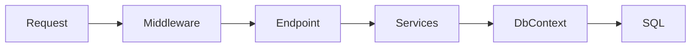

## Why this matters

Most .NET backend interviews assume ASP.NET Core + EF Core. They test whether you understand the **pipeline**, **DI lifetimes**, and **EF tracking/query** pitfalls that cause production incidents.

## Definitions

- **Middleware:** Ordered pipeline components that handle an HTTP request/response before and/or after the next delegate.
- **DbContext:** EF Core unit of work + change tracker for querying and persisting entities; typically scoped per request.
- **Change tracking:** EF watches loaded entities so `SaveChanges` can generate INSERT/UPDATE/DELETE SQL.
- **AsNoTracking:** Query mode that skips tracking for cheaper read-only loads (APIs, projections).
- **N+1 query:** One query for parents plus one query per related child — fix with `Include`, split query, or projection.
- **Migration:** Versioned schema change that evolves the database deliberately with the model.
- **ProblemDetails:** Standard error response shape (`application/problem+json`) for consistent API failures.

## Concept

### Request pipeline

```text
HTTP → middleware → endpoint (minimal API / controller) → services → EF DbContext → DB
```



Middleware is a chain: exception handling, auth, routing, endpoints. Order matters (exception handler early; auth before endpoints).

### Endpoint styles

- **Controllers** — familiar MVC attributes, filters  
- **Minimal APIs** — concise route handlers, great for small services  

Both use the same DI and middleware host.

### EF Core mental model

- `DbContext` = unit of work + change tracker  
- Tracking enabled by default — great for updates, costly for read-only lists  
- Migrations evolve schema deliberately  
- LINQ → SQL; unsupported patterns → client eval surprises  

## Worked example 1 — Minimal API read

```csharp
app.MapGet("/orders/{id:int}", async (int id, AppDb db, CancellationToken ct) =>
{
    var order = await db.Orders
        .AsNoTracking()
        .FirstOrDefaultAsync(o => o.Id == id, ct);
    return order is { } o ? Results.Ok(o) : Results.NotFound();
});
```

## Worked example 2 — Controller + service layer

```csharp
[ApiController]
[Route("api/orders")]
public sealed class OrdersController(OrderService orders) : ControllerBase
{
    [HttpPost]
    public async Task<ActionResult<OrderDto>> Create(CreateOrderRequest req, CancellationToken ct)
    {
        var created = await orders.CreateAsync(req, ct);
        return CreatedAtAction(nameof(Get), new { id = created.Id }, created);
    }

    [HttpGet("{id:int}")]
    public async Task<ActionResult<OrderDto>> Get(int id, CancellationToken ct)
    {
        var order = await orders.GetAsync(id, ct);
        return order is null ? NotFound() : order;
    }
}
```

## Worked example 3 — Tracking vs no-tracking

```csharp
// Read path
var list = await db.Orders.AsNoTracking()
    .Where(o => o.Status == Status.Paid)
    .Select(o => new OrderListItem(o.Id, o.Sku, o.Total))
    .ToListAsync(ct);

// Update path
var order = await db.Orders.FirstAsync(o => o.Id == id, ct);
order.Cancel();
await db.SaveChangesAsync(ct);
```

Project to DTOs for lists. Use tracking when you intend to mutate.

## Worked example 4 — Fixing N+1

```csharp
// Bad: lazy load per order in a loop
foreach (var o in await db.Orders.ToListAsync(ct))
{
    Console.WriteLine(o.Items.Count); // extra queries if lazy enabled
}

// Better: explicit include or projection
var orders = await db.Orders.AsNoTracking()
    .Include(o => o.Items)
    .ToListAsync(ct);

// Often best: project what you need
var dtos = await db.Orders.AsNoTracking()
    .Select(o => new { o.Id, ItemCount = o.Items.Count })
    .ToListAsync(ct);
```

## Worked example 5 — Scoped DbContext

```csharp
builder.Services.AddDbContext<AppDb>(opt =>
    opt.UseNpgsql(builder.Configuration.GetConnectionString("db")));

// DbContext is Scoped — one instance per request
```

Never singleton a pooled context for request work. For `IHostedService`, create scopes explicitly (`IServiceScopeFactory`).

## Migrations and schema

```bash
dotnet ef migrations add AddOrderStatus
dotnet ef database update
```

Treat migrations as reviewed code. Avoid automatic schema mutate in production without a strategy.

## Production checklist

- Health checks + readiness  
- ProblemDetails for errors  
- Authn/authz middleware  
- Timeouts on `HttpClient` (via `IHttpClientFactory`)  
- Connection string / secrets from env  
- Structured logging + Activity/trace ids  
- Rate limiting / output caching when appropriate  

## Interview Q&A

- **Q:** Why scoped `DbContext`?  
  **A:** One unit-of-work per request; singleton would share tracker across threads/requests — bugs and races.
- **Q:** How do you prevent N+1?  
  **A:** `Include` / `AsSplitQuery`, or project with `Select`; avoid lazy load in APIs.
- **Q:** `AsNoTracking` when?  
  **A:** Read-only queries — less overhead, no accidental saves.
- **Q:** Minimal APIs vs controllers?  
  **A:** Minimal for small/focused endpoints; controllers when you want conventions, filters, large surface area.
- **Q:** How does DI interact with EF?  
  **A:** Inject `DbContext` or a repository/service; keep lifetime scoped; don’t dispose early mid-request.
- **Q:** Soft delete / global filters?  
  **A:** `HasQueryFilter` — know it can hide rows and surprise raw queries.

## Pitfalls

- Lazy loading after context disposed  
- Huge tracked graphs on bulk imports — use batching / `ExecuteUpdate`  
- Client-side evaluation pulling entire tables  
- Capturing scoped services in singletons  
- Ignoring migrations in deploy pipeline  
- Returning tracked entities directly from APIs (over-posting / cycle serializers)

## 60-second answer

“ASP.NET Core is middleware then endpoints. I keep controllers/handlers thin, services own business rules, and DbContext scoped per request. For EF I AsNoTracking + project on reads, Include or Select to avoid N+1, and SaveChanges on intentional update paths. Health, ProblemDetails, HttpClient timeouts, and migrations are part of done.”

## Further study

- [ASP.NET Core documentation](https://learn.microsoft.com/en-us/aspnet/core/) — hosting, routing, and web fundamentals
- [EF Core documentation](https://learn.microsoft.com/en-us/ef/core/) — querying, tracking, and migrations
- [Middleware](https://learn.microsoft.com/en-us/aspnet/core/fundamentals/middleware/) — pipeline order and custom components
- [Tracking vs no-tracking queries](https://learn.microsoft.com/en-us/ef/core/querying/tracking) — when change tracking helps or hurts

## Practice prompts

1. Rewrite a chatty loop into one projected EF query  
2. Explain a bug from singleton DbContext with two concurrent requests  
3. Design Create/Get/Cancel order endpoints with proper status codes  
4. Choose Include vs AsSplitQuery vs projection for a complex graph
