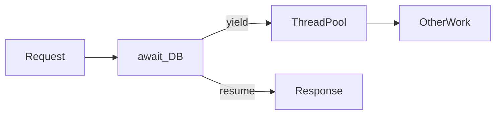

## Why this matters

Async is the default for .NET servers. Interviewers probe whether you understand **thread pool freeing**, cancellation, and why `.Result` / `.Wait()` are dangerous — not whether you can sprinkle `async` on every method.

## Definitions

- **async/await:** Write async code sequentially while yielding the thread during I/O waits instead of blocking it.
- **Task / Task<T>:** Promise representing an async operation’s completion and optional result (or fault).
- **CancellationToken:** Cooperative cancel signal passed through async chains; operations must observe it.
- **async void:** Cannot be awaited; exceptions are hard to observe — reserve for UI/event handlers only.
- **ValueTask / ValueTask<T>:** Allocation-friendlier async result for hot paths that often complete synchronously.
- **ConfigureAwait:** Controls whether to resume on the captured sync context; libraries often use `ConfigureAwait(false)`.
- **Thread-pool starvation:** Blocking (`.Result` / `.Wait()`) exhausts workers so other requests cannot progress.

## Concept

`async` methods return an incomplete `Task`/`Task<T>`/`ValueTask`. `await` yields so the thread can do other work until the operation completes.



Async shines for **I/O-bound** work (HTTP, DB, files). CPU-bound work still needs careful offload (`Task.Run`) so you don’t block request threads.

### Core rules

1. Async all the way — don’t block on async in request paths  
2. Pass `CancellationToken` through  
3. Avoid `async void` (except event handlers)  
4. Prefer `Task` for public APIs; `ValueTask` for hot paths / caching completed results  
5. Capture context: ASP.NET Core has no legacy sync context — `.Result` still starves threads  

## Worked example 1 — Request path done right

```csharp
public async Task<Order?> GetAsync(int id, CancellationToken ct)
{
    return await db.Orders
        .AsNoTracking()
        .FirstOrDefaultAsync(o => o.Id == id, ct);
}

// Bad in request path:
// return GetAsync(id).Result;
```

## Worked example 2 — Parallel I/O with limits

```csharp
public async Task<IReadOnlyList<User>> LoadManyAsync(
    IEnumerable<string> ids, CancellationToken ct)
{
    using var gate = new SemaphoreSlim(8);
    var tasks = ids.Select(async id =>
    {
        await gate.WaitAsync(ct);
        try { return await LoadUserAsync(id, ct); }
        finally { gate.Release(); }
    });
    return await Task.WhenAll(tasks);
}
```

Unbounded `Task.WhenAll` on thousands of calls can overwhelm downstreams — gate concurrency.

## Worked example 3 — Timeouts and cancellation

```csharp
using var cts = CancellationTokenSource.CreateLinkedTokenSource(ct);
cts.CancelAfter(TimeSpan.FromSeconds(2));

try
{
    return await http.GetFromJsonAsync<Pref>(url, cts.Token);
}
catch (OperationCanceledException) when (cts.IsCancellationRequested)
{
    throw new TimeoutException($"timed out calling {url}");
}
```

Honor caller tokens; add your own timeout with linked CTS when needed.

## Worked example 4 — Channels for producers/consumers

```csharp
var channel = Channel.CreateBounded<Job>(100);

// producer
await channel.Writer.WriteAsync(job, ct);

// consumer
await foreach (var job in channel.Reader.ReadAllAsync(ct))
{
    await ProcessAsync(job, ct);
}
```

Channels beat ad-hoc blocking collections for async pipelines.

## ConfigureAwait

```csharp
// Library code often avoids capturing sync context:
var data = await stream.ReadAsync(buf, ct).ConfigureAwait(false);
```

In **ASP.NET Core**, there’s no UI sync context — deadlocks from `.Result` are less “classic WPF,” but blocking still hurts scalability. In libraries, `ConfigureAwait(false)` remains a good habit.

## Synchronization

```csharp
private readonly SemaphoreSlim _gate = new(1, 1);

public async Task UpdateAsync(CancellationToken ct)
{
    await _gate.WaitAsync(ct);
    try { /* critical async section */ }
    finally { _gate.Release(); }
}
```

Don’t use `lock` across `await`. Use `SemaphoreSlim`, channels, or concurrent collections.

## Interview Q&A

- **Q:** Why is `.Result` dangerous?  
  **A:** Blocks a thread waiting on async work; can deadlock with sync contexts and cause thread-pool starvation under load.
- **Q:** `ConfigureAwait(false)`?  
  **A:** Don’t marshal back to the captured context — important in libraries/UI; less critical in ASP.NET Core apps but still fine in libs.
- **Q:** When is sync OK?  
  **A:** Pure CPU-bound compute; still offload if it would block request threads too long.
- **Q:** `Task.Run` on ASP.NET?  
  **A:** Don’t wrap already-async I/O. Use for CPU work you must not run on the request thread — carefully.
- **Q:** `ValueTask` when?  
  **A:** Hot paths that often complete synchronously; don’t await twice or use casually everywhere.
- **Q:** How do you cancel EF/HTTP?  
  **A:** Pass `CancellationToken` to `*Async` APIs; tie to request aborted token.

## Pitfalls

- Sync-over-async (`.Result`, `.Wait()`, `GetAwaiter().GetResult()`) on request threads  
- Mixing sync EF calls in async pipelines  
- Fire-and-forget (`_ = DoAsync()`) without error logging / lifetime tracking  
- Forgetting cancellation  
- `async void` swallowing exceptions  
- `lock` + `await`  
- Unbounded parallel fan-out  
- Using `Task.Run` to “make it async” around blocking legacy APIs without a plan

## 60-second answer

“Async/await frees threads during I/O. I keep async all the way, pass CancellationToken, and never block with Result/Wait on request paths. I gate parallel fan-out, use channels for pipelines, SemaphoreSlim instead of lock across await, and I treat ConfigureAwait as a library concern.”

## Further study

- [Asynchronous programming with async/await](https://learn.microsoft.com/en-us/dotnet/csharp/asynchronous-programming/) — language model and best practices
- [Task-based asynchronous pattern](https://learn.microsoft.com/en-us/dotnet/standard/asynchronous-programming-patterns/task-based-asynchronous-pattern-tap) — TAP conventions used across .NET
- [Cancellation in managed threads](https://learn.microsoft.com/en-us/dotnet/standard/threading/cancellation-in-managed-threads) — tokens, linked sources, and cooperative cancel
- [Channels](https://learn.microsoft.com/en-us/dotnet/core/extensions/channels) — producer/consumer pipelines without blocking

## Practice prompts

1. Find the deadlock/starvation risk in a controller using `.Result`  
2. Add timeout + cancellation to three parallel outbound calls  
3. Design a bounded background worker with `Channel<T>`  
4. Explain when you’d choose `ValueTask` over `Task`
