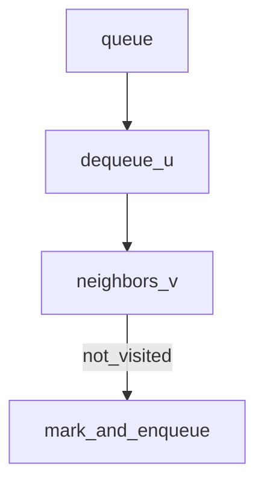

## Why this matters

BFS is the interview default for **shortest path in unweighted graphs**, level-order trees, and “minimum steps” transformation problems.

## Definitions

- **BFS (breadth-first search):** Exploring a graph or tree level by level using a queue, visiting all nodes at distance d before d+1.
- **Queue:** The FIFO structure that drives BFS — dequeue the current node, enqueue unvisited neighbors.
- **Level-order traversal:** Visiting tree nodes one depth at a time; typically process `queue.size()` nodes per level.
- **Unweighted shortest path:** With equal (or unit) edge costs, the first time BFS reaches a node is a fewest-edges path.
- **Multi-source BFS:** Seeding the queue with multiple starts at distance 0 so nearest-source distances spread in one pass.
- **Visited / seen:** Markers that prevent re-enqueueing; mark when enqueued (not when dequeued) to keep the queue lean.
- **Adjacency list:** The usual graph representation — map/array from node → neighbor list — that BFS iterates.

## Concept

Use a queue. Explore neighbors **level by level**. First time you reach a node in an unweighted graph → fewest edges.



**DFS contrast:** DFS dives deep (paths, topology, components with recursion). BFS is breadth-first distance.

## Worked example 1 — Binary tree level order

```java
public List<List<Integer>> levelOrder(TreeNode root) {
  List<List<Integer>> res = new ArrayList<>();
  if (root == null) return res;
  Queue<TreeNode> q = new ArrayDeque<>();
  q.add(root);
  while (!q.isEmpty()) {
    int n = q.size();
    List<Integer> level = new ArrayList<>(n);
    for (int i = 0; i < n; i++) {
      TreeNode cur = q.poll();
      level.add(cur.val);
      if (cur.left != null) q.add(cur.left);
      if (cur.right != null) q.add(cur.right);
    }
    res.add(level);
  }
  return res;
}
```

```csharp
public IList<IList<int>> LevelOrder(TreeNode root) {
  var res = new List<IList<int>>();
  if (root is null) return res;
  var q = new Queue<TreeNode>();
  q.Enqueue(root);
  while (q.Count > 0) {
    int n = q.Count;
    var level = new List<int>(n);
    for (int i = 0; i < n; i++) {
      var cur = q.Dequeue();
      level.Add(cur.val);
      if (cur.left is not null) q.Enqueue(cur.left);
      if (cur.right is not null) q.Enqueue(cur.right);
    }
    res.Add(level);
  }
  return res;
}
```

## Worked example 2 — Shortest path in grid (4-direction)

```java
int shortestPath(int[][] grid) {
  int m = grid.length, n = grid[0].length;
  if (grid[0][0] == 1 || grid[m-1][n-1] == 1) return -1;
  int[][] dirs = {{1,0},{-1,0},{0,1},{0,-1}};
  Queue<int[]> q = new ArrayDeque<>();
  boolean[][] seen = new boolean[m][n];
  q.add(new int[]{0, 0, 1}); // r, c, dist
  seen[0][0] = true;
  while (!q.isEmpty()) {
    int[] cur = q.poll();
    int r = cur[0], c = cur[1], d = cur[2];
    if (r == m - 1 && c == n - 1) return d;
    for (int[] dir : dirs) {
      int nr = r + dir[0], nc = c + dir[1];
      if (nr < 0 || nc < 0 || nr >= m || nc >= n) continue;
      if (seen[nr][nc] || grid[nr][nc] == 1) continue;
      seen[nr][nc] = true;
      q.add(new int[]{nr, nc, d + 1});
    }
  }
  return -1;
}
```

```csharp
int ShortestPath(int[][] grid) {
  int m = grid.Length, n = grid[0].Length;
  if (grid[0][0] == 1 || grid[m - 1][n - 1] == 1) return -1;
  int[][] dirs = { new[]{1,0}, new[]{-1,0}, new[]{0,1}, new[]{0,-1} };
  var q = new Queue<(int r, int c, int d)>();
  var seen = new bool[m, n];
  q.Enqueue((0, 0, 1));
  seen[0, 0] = true;
  while (q.Count > 0) {
    var (r, c, d) = q.Dequeue();
    if (r == m - 1 && c == n - 1) return d;
    foreach (var dir in dirs) {
      int nr = r + dir[0], nc = c + dir[1];
      if (nr < 0 || nc < 0 || nr >= m || nc >= n) continue;
      if (seen[nr, nc] || grid[nr][nc] == 1) continue;
      seen[nr, nc] = true;
      q.Enqueue((nr, nc, d + 1));
    }
  }
  return -1;
}
```

## Worked example 3 — Multi-source BFS (rotting oranges pattern)

Enqueue **all** sources first with distance 0; one BFS gives min time for infection/spread.

```java
// seed queue with every rotten orange at minute 0
// BFS neighbors; track max minutes and remaining fresh count
```

## Graph adjacency template

```java
Map<Integer, List<Integer>> g = new HashMap<>();
void addEdge(int u, int v) {
  g.computeIfAbsent(u, k -> new ArrayList<>()).add(v);
  g.computeIfAbsent(v, k -> new ArrayList<>()).add(u);
}
```

```csharp
var g = new Dictionary<int, List<int>>();
void AddEdge(int u, int v) {
  if (!g.ContainsKey(u)) g[u] = new List<int>();
  if (!g.ContainsKey(v)) g[v] = new List<int>();
  g[u].Add(v); g[v].Add(u);
}
```

## Complexity

- Time: O(V + E)  
- Space: O(V) for queue + visited

## Interview Q&A

- **Q:** Why not DFS for shortest path?
  **A:** DFS finds *a* path, not fewest edges (unless you explore all and minimize).
- **Q:** Weighted edges?
  **A:** Use Dijkstra (non-negative) or 0-1 BFS / deque for special weights.
- **Q:** When mark visited — before enqueue or after dequeue?
  **A:** Prefer **before enqueue** to avoid duplicate queue entries exploding memory.

## Pitfalls

- Forgetting `visited` on undirected graphs → infinite loops  
- Using recursion DFS on deep skewed trees → stack overflow  
- Confusing “level size loop” and mixing levels

## 60-second answer

“BFS uses a queue to explore by distance. On unweighted graphs the first hit is shortest. Tree level-order is the same idea with per-level sizing. I mark visited when enqueueing to keep the queue lean.”

## Further study

- [Breadth-first search (Wikipedia)](https://en.wikipedia.org/wiki/Breadth-first_search) — level-order exploration with a queue
- [Graph theory (Wikipedia)](https://en.wikipedia.org/wiki/Graph_theory) — vertices, edges, and adjacency
- [Shortest path problem (Wikipedia)](https://en.wikipedia.org/wiki/Shortest_path_problem) — why BFS is fewest-edges on unweighted graphs
- [Queue (Wikipedia)](https://en.wikipedia.org/wiki/Queue_(abstract_data_type)) — FIFO structure driving BFS

## Practice prompts

1. Word ladder (shortest transformation)  
2. Binary tree zigzag level order  
3. Walls and gates / nearest zero in matrix (multi-source)
