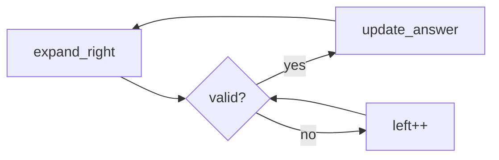

## Why this matters

Sliding window is the default tool for “longest/shortest subarray/substring with constraint X”. If you can maintain window state in O(1)/O(k) per move, you get O(n).

## Definitions

- **Sliding window:** Maintaining a contiguous subarray/substring `[left, right]` while expanding and shrinking to satisfy a constraint in O(n).
- **Fixed window:** A window whose size is always `k`; each slide adds one element and removes one.
- **Variable window:** A window that expands `right` freely and shrinks `left` whenever the constraint is violated.
- **Window state:** Aggregates for the current range (sum, counts, distinct chars) updated in O(1) or O(alphabet) per move.
- **Valid window:** A window that currently satisfies the problem constraint (e.g., no duplicate chars, at most K distinct).
- **Amortized O(n):** Each index enters and leaves the window at most once, so total expand/shrink work is linear.
- **Shrink rule:** The precise condition for advancing `left` — getting this wrong is the main source of off-by-one bugs.

## Concept

A window is a contiguous range `[left, right]`.

| Style | Rule |
|-------|------|
| **Fixed** | Size `k` always; slide by one |
| **Variable** | Expand `right`; shrink `left` when invalid |

**Invariant:** every index enters and leaves the window at most once → O(n).



## Worked example 1 — Longest substring without repeating chars

```java
public int lengthOfLongestSubstring(String s) {
  Map<Character, Integer> last = new HashMap<>();
  int best = 0, left = 0;
  for (int right = 0; right < s.length(); right++) {
    char c = s.charAt(right);
    if (last.containsKey(c)) {
      left = Math.max(left, last.get(c) + 1);
    }
    last.put(c, right);
    best = Math.max(best, right - left + 1);
  }
  return best;
}
```

```csharp
public int LengthOfLongestSubstring(string s) {
  var last = new Dictionary<char, int>();
  int best = 0, left = 0;
  for (int right = 0; right < s.Length; right++) {
    char c = s[right];
    if (last.TryGetValue(c, out int prev))
      left = Math.Max(left, prev + 1);
    last[c] = right;
    best = Math.Max(best, right - left + 1);
  }
  return best;
}
```

## Worked example 2 — Max sum of subarray size k (fixed)

```java
public int maxSumFixed(int[] a, int k) {
  int sum = 0;
  for (int i = 0; i < k; i++) sum += a[i];
  int best = sum;
  for (int i = k; i < a.length; i++) {
    sum += a[i] - a[i - k];
    best = Math.max(best, sum);
  }
  return best;
}
```

```csharp
public int MaxSumFixed(int[] a, int k) {
  int sum = 0;
  for (int i = 0; i < k; i++) sum += a[i];
  int best = sum;
  for (int i = k; i < a.Length; i++) {
    sum += a[i] - a[i - k];
    best = Math.Max(best, sum);
  }
  return best;
}
```

## Worked example 3 — Minimum window substring (hard pattern)

Find smallest window in `s` covering all chars of `t`.

```java
public String minWindow(String s, String t) {
  int[] need = new int[128];
  for (char c : t.toCharArray()) need[c]++;
  int missing = t.length(), left = 0, bestL = 0, bestLen = Integer.MAX_VALUE;
  for (int right = 0; right < s.length(); right++) {
    char c = s.charAt(right);
    if (need[c] > 0) missing--;
    need[c]--;
    while (missing == 0) {
      if (right - left + 1 < bestLen) {
        bestLen = right - left + 1;
        bestL = left;
      }
      char d = s.charAt(left++);
      need[d]++;
      if (need[d] > 0) missing++;
    }
  }
  return bestLen == Integer.MAX_VALUE ? "" : s.substring(bestL, bestL + bestLen);
}
```

```csharp
public string MinWindow(string s, string t) {
  int[] need = new int[128];
  foreach (char c in t) need[c]++;
  int missing = t.Length, left = 0, bestL = 0, bestLen = int.MaxValue;
  for (int right = 0; right < s.Length; right++) {
    char c = s[right];
    if (need[c] > 0) missing--;
    need[c]--;
    while (missing == 0) {
      if (right - left + 1 < bestLen) {
        bestLen = right - left + 1;
        bestL = left;
      }
      char d = s[left++];
      need[d]++;
      if (need[d] > 0) missing++;
    }
  }
  return bestLen == int.MaxValue ? "" : s.Substring(bestL, bestLen);
}
```

## Template (variable window)

```text
left = 0
for right in 0..n-1:
  add a[right] into window state
  while window invalid:
    remove a[left]; left++
  update answer from window
```

## Interview Q&A

- **Q:** When is sliding window wrong?
  **A:** Non-contiguous subsequences; negative numbers with “max sum of size ≤ k” may need other DP/deque tricks.
- **Q:** HashMap vs frequency array?
  **A:** Array when alphabet is small (ASCII); map for unicode/generic keys.
- **Q:** How do you explain O(n)?
  **A:** Each index is added once and removed once; total work amortizes to linear.

## Pitfalls

- Shrinking past the last occurrence incorrectly (`left = last[c]` without `max`)
- Updating answer before the window is valid
- Off-by-one in `right - left + 1`

## 60-second answer

“Sliding window keeps a contiguous range and a compact state. I expand right, shrink left when the constraint breaks, and each index moves at most once so it’s O(n). Fixed windows are the special case of constant width.”

## Further study

- [Array slicing (Wikipedia)](https://en.wikipedia.org/wiki/Array_slicing) — contiguous ranges the window represents
- [Substring (Wikipedia)](https://en.wikipedia.org/wiki/Substring) — string windows and length constraints
- [Hash table (Wikipedia)](https://en.wikipedia.org/wiki/Hash_table) — maintaining window counts and last-seen indices
- [Amortized analysis (Wikipedia)](https://en.wikipedia.org/wiki/Amortized_analysis) — why each index enters/leaves once → O(n)

## Practice prompts

1. Longest substring with at most K distinct characters  
2. Max consecutive ones with at most K flips  
3. Fruit into baskets (at most 2 types)
