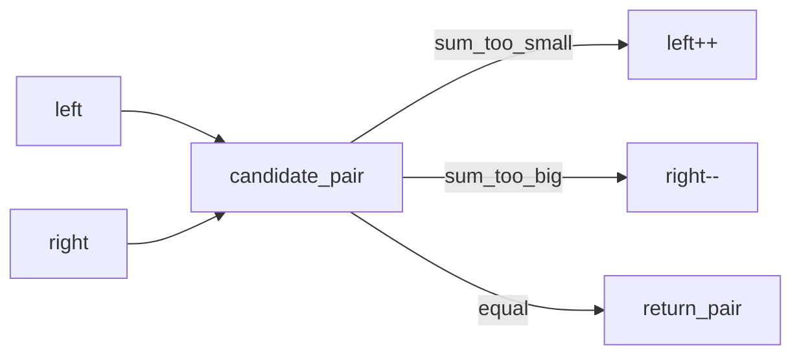

## Why this matters

Two pointers turns many O(n²) nested scans into O(n). Interviewers love it because it tests whether you notice **monotonic structure** (sorted data, opposing constraints) instead of brute force.

## Definitions

- **Two pointers:** An O(n) technique that maintains two indices moving by a rule, replacing nested O(n²) scans when structure allows.
- **Opposite-ends pointers:** One index at the start and one at the end, moving inward based on comparisons (e.g., two-sum on a sorted array).
- **Same-direction (slow/fast) pointers:** Both advance left-to-right — slow tracks the write/valid frontier; fast scans ahead.
- **Monotonic structure:** The property that each pointer move permanently discards options (sorted order or shrinking feasibility), justifying correctness.
- **In-place partition / compaction:** Using slow/fast pointers to rewrite an array (uniques, removals) with O(1) extra space.
- **Cycle detection (Floyd):** Slow moves one step and fast moves two on a linked list; a meeting implies a cycle.
- **Invariant:** The condition that remains true after every move (e.g., “all pairs with current left need a larger partner”).

## Concept

Keep two indices that move according to a rule:

1. **Opposite ends** — `left` at start, `right` at end; move based on sum/compare
2. **Same direction** — slow/fast (remove duplicates, partition, cycle detection)
3. **Sliding window cousin** — window edges are also two pointers (next lesson)

**When it works:** each move permanently discards options (because the array is sorted, or an invariant shrinks the search space).

## Mental model



## Worked example 1 — Two sum (sorted)

Given a **sorted** array, find two indices whose values sum to `target`.

```java
public int[] twoSumSorted(int[] nums, int target) {
  int l = 0, r = nums.length - 1;
  while (l < r) {
    int sum = nums[l] + nums[r];
    if (sum == target) return new int[]{l, r};
    if (sum < target) l++;   // need larger sum
    else r--;                // need smaller sum
  }
  return new int[]{-1, -1};
}
```

```csharp
public int[] TwoSumSorted(int[] nums, int target) {
  int l = 0, r = nums.Length - 1;
  while (l < r) {
    int sum = nums[l] + nums[r];
    if (sum == target) return new[] { l, r };
    if (sum < target) l++;
    else r--;
  }
  return new[] { -1, -1 };
}
```

**Complexity:** O(n) time, O(1) extra space.

## Worked example 2 — Remove duplicates in-place (sorted)

Return new length after unique compaction.

```java
public int removeDuplicates(int[] nums) {
  if (nums.length == 0) return 0;
  int slow = 0;
  for (int fast = 1; fast < nums.length; fast++) {
    if (nums[fast] != nums[slow]) {
      slow++;
      nums[slow] = nums[fast];
    }
  }
  return slow + 1;
}
```

```csharp
public int RemoveDuplicates(int[] nums) {
  if (nums.Length == 0) return 0;
  int slow = 0;
  for (int fast = 1; fast < nums.Length; fast++) {
    if (nums[fast] != nums[slow]) {
      slow++;
      nums[slow] = nums[fast];
    }
  }
  return slow + 1;
}
```

## Worked example 3 — Container with most water

```java
public int maxArea(int[] h) {
  int l = 0, r = h.length - 1, best = 0;
  while (l < r) {
    int height = Math.min(h[l], h[r]);
    best = Math.max(best, height * (r - l));
    if (h[l] < h[r]) l++; else r--;
  }
  return best;
}
```

```csharp
public int MaxArea(int[] h) {
  int l = 0, r = h.Length - 1, best = 0;
  while (l < r) {
    int height = Math.Min(h[l], h[r]);
    best = Math.Max(best, height * (r - l));
    if (h[l] < h[r]) l++; else r--;
  }
  return best;
}
```

**Why move the shorter side?** Width always shrinks; only a taller short-side can improve area.

## Linked-list variant — cycle detection (Floyd)

```java
boolean hasCycle(ListNode head) {
  ListNode slow = head, fast = head;
  while (fast != null && fast.next != null) {
    slow = slow.next;
    fast = fast.next.next;
    if (slow == fast) return true;
  }
  return false;
}
```

```csharp
bool HasCycle(ListNode head) {
  var slow = head; var fast = head;
  while (fast is not null && fast.next is not null) {
    slow = slow.next!;
    fast = fast.next.next!;
    if (ReferenceEquals(slow, fast)) return true;
  }
  return false;
}
```

## Interview Q&A

- **Q:** Two pointers vs hash map for two-sum?
  **A:** Unsorted → hash map O(n) time / O(n) space. Sorted (or sorting allowed) → two pointers O(n)/O(1) after sort O(n log n).
- **Q:** How do you handle duplicates for “unique pairs”?
  **A:** After finding a pair, skip equal values: `while (l < r && nums[l] == nums[l+1]) l++;`
- **Q:** Prove correctness briefly?
  **A:** For sorted two-sum: if `sum < target`, any pair with current `l` and index `< r` is even smaller → safe to `l++`. Symmetric for `r--`.

## Pitfalls

- Using opposite-end pointers on **unsorted** data
- Off-by-one when problem asks 1-based indices
- Forgetting overflow: prefer `long` for sums when values are large
- Mutating arrays without clarifying in-place is allowed

## 60-second answer

“Two pointers exploit order. On a sorted array I start at both ends and move the side that fixes the invariant — for two-sum, move left if sum is too small. Same-direction slow/fast handles in-place filtering and linked-list cycles. Goal is O(n) time and usually O(1) space.”

## Further study

- [In-place algorithm (Wikipedia)](https://en.wikipedia.org/wiki/In-place_algorithm) — O(1) extra-space rewrites with slow/fast pointers
- [Cycle detection (Wikipedia)](https://en.wikipedia.org/wiki/Cycle_detection) — Floyd’s tortoise and hare for linked lists
- [Array (Wikipedia)](https://en.wikipedia.org/wiki/Array_(data_structure)) — sorted arrays where opposite-end pointers apply
- [Pointer (Wikipedia)](https://en.wikipedia.org/wiki/Pointer_(computer_programming)) — index/reference movement mental model

## Practice prompts

1. 3Sum (unique triplets) — sort + two pointers inside a loop  
2. Trapping rain water — two pointers with leftMax/rightMax  
3. Palindrome check on alphanumeric string — skip non-letters from both ends
