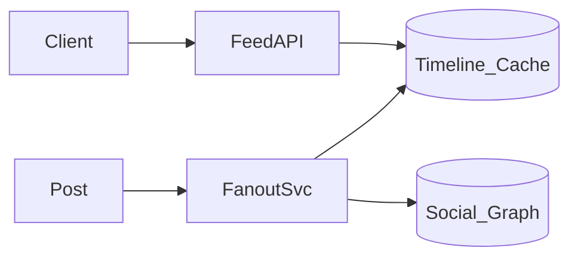

## Why this matters

Feeds teach fan-out trade-offs at celebrity scale — classic senior design.

## Definitions

- **News feed:** A home timeline of posts from users you follow, optimized for read-heavy traffic with eventual consistency measured in seconds.
- **Fan-out on write:** Pushing a new post into each follower’s timeline cache at create time — fast reads, expensive for celebrity authors.
- **Fan-out on read:** Building the feed by pulling recent posts from followees at read time — cheaper writes, heavier reads.
- **Hybrid fan-out:** Write-fan-out for normal users and read-fan-out for celebrities to avoid mega-follower write storms.
- **Timeline cache:** Typically a Redis sorted set per user (`score=time`, `member=post_id`) serving the home feed.
- **Celebrity problem:** Authors with millions of followers for whom synchronous write fan-out is infeasible on the request path.
- **Cursor pagination:** Paging by `(score, post_id)` rather than offset so feeds stay stable under concurrent inserts.

## Requirements

- Home timeline of followed users’ posts  
- Post create latency low  
- Read heavy; eventual consistency OK seconds-level

## Fan-out strategies

| Strategy | Write | Read | Best for |
|----------|-------|------|----------|
| On write | Push to followers’ caches | Fast | Normal users |
| On read | Pull from followees | Heavier | Celebrities |
| Hybrid | Write for normals; read for celebs | Mixed | Production |



## Data

```text
posts(id, author_id, body, created_at)
follows(follower_id, followee_id)
timeline_cache: user_id → zset(score=time, post_id)
```

## Ranking

- Time + affinity + ML ranker async  
- Precompute candidates; re-rank top K on read

## Interview Q&A

- **Q:** Celebrity problem?
  **A:** Skip write fan-out for mega followings; mix on read.
- **Q:** Pagination?
  **A:** Cursor by `(score, post_id)` not offset.

## Pitfalls

- Synchronous fan-out to 50M followers on request path  
- No backpressure on fan-out workers

## 60-second answer

“Hybrid fan-out: push to timelines for normal authors, pull for celebrities. Cache timelines in Redis ZSETs, paginate by cursor, rank top-K on read.”

## Further study

- [System Design Primer](https://github.com/donnemartin/system-design-primer) — social feed / timeline design notes
- [Fan-out (Wikipedia)](https://en.wikipedia.org/wiki/Fan-out_(software)) — write vs read fan-out terminology
- [Redis sorted sets](https://redis.io/docs/latest/develop/data-types/sorted-sets/) — ZSET timelines by score
- [Eventual consistency (Wikipedia)](https://en.wikipedia.org/wiki/Eventual_consistency) — feed freshness expectations

## Practice prompts

1. Design stories/ephemeral posts  
2. Invalidate cache on unfollow  
3. Estimate fan-out QPS for 10M DAU
