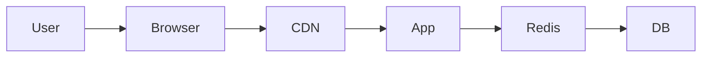

## Why this matters

Latency and cost are won at the edge. Seniors design cache layers deliberately.

## Definitions

- **Caching:** Storing copies of data closer to the reader (memory, Redis, CDN, browser) to cut latency and origin load while accepting freshness trade-offs.
- **CDN (content delivery network):** A geographically distributed edge cache optimized for public static/GET content (images, JS, assets).
- **Cache invalidation:** Making stale entries disappear via TTL expiry, explicit purge on write, or versioned URLs for static assets.
- **TTL (time to live):** How long a cached entry may be served before it is considered expired and must be refreshed.
- **Cache stampede / thundering herd:** Many clients simultaneously missing the same key and hammering origin — mitigated by soft TTL, singleflight, or jitter.
- **Stale-while-revalidate:** Serving a slightly stale response while refreshing asynchronously when near-real-time freshness is acceptable.
- **Source of truth:** The authoritative store (usually the database) that caches must eventually reflect after writes.

## Layers

| Layer | Good for |
|-------|----------|
| CDN | Static, public GETs, images |
| Redis | Hot personalized data |
| App memory | Ultra-hot tiny objects |
| DB | Source of truth |

## Invalidation

- TTL  
- Explicit purge on write  
- Versioned URLs for static assets (`app.v42.js`)

## Stampede & thundering herd

Soft TTL, singleflight, randomized expiry.

## Interview Q&A

- **Q:** Can CDN cache personalized pages?
  **A:** Usually no — vary by cookie carefully or don’t.
- **Q:** Stale while revalidate?
  **A:** Serve stale, refresh async — great for near-real-time OK data.

## Pitfalls

- Caching 500 responses  
- Forgetting auth on private CDN content

## 60-second answer

“I stack CDN for public static, Redis for hot dynamic reads, DB as truth. Writes invalidate or version keys; I plan for stampedes and never cache private data at the public edge.”

## Further study

- [Content delivery network (Wikipedia)](https://en.wikipedia.org/wiki/Content_delivery_network) — edge caching for static assets
- [Cache (computing) (Wikipedia)](https://en.wikipedia.org/wiki/Cache_(computing)) — layers, hit ratio, and invalidation
- [Cache stampede (Wikipedia)](https://en.wikipedia.org/wiki/Cache_stampede) — thundering herd on expiry
- [System Design Primer](https://github.com/donnemartin/system-design-primer) — caching patterns in distributed systems

## Practice prompts

1. Cache strategy for product detail pages  
2. Global purge after price update  
3. Estimate CDN hit ratio impact on origin QPS
