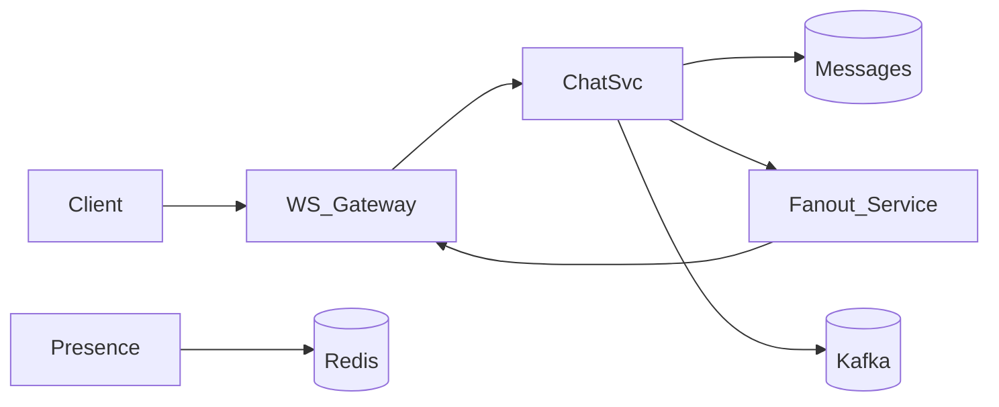

## Why this matters

Chat systems combine realtime delivery, fan-out, storage, and presence — a rich HLD that shows you can slice problems.

## Definitions

- **Chat / messaging system:** A distributed design for 1:1 and group messages with realtime delivery, durable history, presence, and delivery/read states.
- **WebSocket gateway:** The edge service that holds long-lived client connections and routes send/receive traffic to chat services.
- **Fan-out:** Pushing a persisted message to each recipient’s online connections (or inboxes), especially costly for large groups.
- **Write fan-out vs read fan-out:** Pushing to member inboxes at write time (small groups) versus members pulling/catching up on read (huge channels).
- **Presence:** Soft online/offline state (often Redis heartbeats with TTL) indicating which gateway a user is connected to — not strongly consistent.
- **Delivery guarantee:** Usually at-least-once push plus idempotent clients keyed by message id; exactly-once across devices is avoided in favor of sync.
- **Per-conversation sequence:** A monotonic seq (or similar) per conversation that establishes message order for that thread.

## Requirements

**Functional:** 1:1 messages, group chat, delivery states (sent/delivered/read), offline inbox, media optional.  
**Non-functional:** low latency fan-out, durable history, ordering per conversation, multi-device sync.

## High-level



## Message flow (1:1)

1. Client sends over WebSocket to gateway  
2. Chat service persists message (source of truth)  
3. Push to recipient connections if online  
4. Else leave for sync on reconnect  
5. Ack back to sender with server message id + timestamp

## Data model (sketch)

```text
conversations(id, type, created_at)
conversation_members(conversation_id, user_id, last_read_msg_id)
messages(id, conversation_id, sender_id, body, created_at, seq)
```

Use **monotonic seq per conversation** for ordering.

## Group fan-out

| Approach | When |
|----------|------|
| Write fan-out | Small groups; push to each inbox at write time |
| Read fan-out | Huge groups/channels; members pull/catch up |
| Hybrid | Fan-out to online; persist once for history |

## Presence

- Heartbeat to Redis `user:{id} → gatewayId` with TTL  
- Gateway unregisters on disconnect  
- Don’t treat presence as strongly consistent

## Delivery guarantees

- At-least-once push + idempotent client handling (message id)  
- Read receipts async; don’t block send path  
- Exactly-once across devices is hard — aim for **idempotent sync**

## Scale talking points

- Partition messages by `conversation_id`  
- Sticky WS sessions or connection directory in Redis  
- Media via object storage + CDN; chat body stores URL  
- Moderation/async virus scan for uploads

## Interview Q&A

- **Q:** How do you order messages?
  **A:** Per-conversation sequence from the service that owns the partition; clients sort by seq.
- **Q:** What about multi-device?
  **A:** Each device maintains cursor; sync API returns since `last_seq`.
- **Q:** Kafka role?
  **A:** Decouple persistence from push/notifications/analytics.

## Pitfalls

- Global message clock ordering across conversations (unnecessary)  
- Storing large media in DB  
- Blocking send on push to all offline devices

## 60-second answer

“I’d persist first, then fan-out over WebSocket gateways looked up via a connection directory. Groups choose write vs read fan-out by size. Ordering uses per-conversation sequences; presence lives in Redis with TTLs; media is offloaded to object storage.”

## Further study

- [System Design Primer](https://github.com/donnemartin/system-design-primer) — chat/messaging system design notes
- [WebSocket (Wikipedia)](https://en.wikipedia.org/wiki/WebSocket) — long-lived realtime connections
- [Publish–subscribe pattern (Wikipedia)](https://en.wikipedia.org/wiki/Publish%E2%80%93subscribe_pattern) — fan-out delivery mental model
- [Presence information (Wikipedia)](https://en.wikipedia.org/wiki/Presence_information) — online/offline soft state

## Practice prompts

1. Add end-to-end encryption constraints  
2. Design typing indicators without melting Redis  
3. Estimate storage for 5B messages/day
