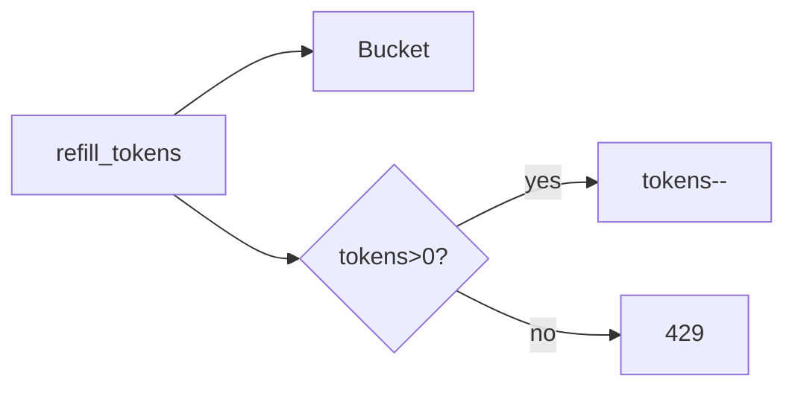

## Why this matters

Almost every API needs limiting for fairness, cost control, and abuse prevention. Interviews probe algorithms **and** where the limiter sits (gateway vs service).

## Definitions

- **Rate limiter:** A component that caps how many requests a key (user, API key, IP) may make in a time window, typically returning `429` with `Retry-After` when exceeded.
- **Token bucket:** An algorithm where tokens refill at a steady rate into a bucket of capacity B; each request spends a token, allowing controlled bursts.
- **Fixed window:** Counting requests in discrete intervals (e.g., each minute) — simple but allows up to ~2× burst at window boundaries.
- **Sliding window:** A more accurate limit using a timestamp log or weighted blend of previous and current windows to reduce boundary bursts.
- **Distributed rate limiting:** Enforcing one shared limit across many service instances, often via Redis counters or Lua scripts.
- **Placement:** Where the limiter runs — API gateway (central, coarse) vs per-service (finer, closer to business keys).
- **Burst:** A short spike of requests allowed by algorithms like token bucket without violating the long-term refill rate.

## Requirements

- Limit by API key / user / IP  
- Return `429` + `Retry-After`  
- Soft vs hard limits; burst friendly?  
- Distributed across many instances

## Algorithms

### Fixed window
Count requests in `[0,60s)`. Simple; **boundary burst** (2× at edge).

### Sliding window log
Store timestamps; accurate; memory heavy.

### Sliding window counter
Weighted blend of previous + current window — good compromise.

### Token bucket (favorite)
Tokens refill at rate R; capacity B allows bursts.



## Worked example — token bucket (single node)

```java
class TokenBucket {
  private final long capacity;
  private final double refillPerSec;
  private double tokens;
  private long lastNanos;

  TokenBucket(long capacity, double refillPerSec) {
    this.capacity = capacity;
    this.refillPerSec = refillPerSec;
    this.tokens = capacity;
    this.lastNanos = System.nanoTime();
  }

  public synchronized boolean allow() {
    long now = System.nanoTime();
    double delta = (now - lastNanos) / 1_000_000_000.0;
    tokens = Math.min(capacity, tokens + delta * refillPerSec);
    lastNanos = now;
    if (tokens < 1) return false;
    tokens -= 1;
    return true;
  }
}
```

```csharp
sealed class TokenBucket {
  private readonly long _capacity;
  private readonly double _refillPerSec;
  private double _tokens;
  private long _lastTicks;
  private readonly object _gate = new();

  public TokenBucket(long capacity, double refillPerSec) {
    _capacity = capacity;
    _refillPerSec = refillPerSec;
    _tokens = capacity;
    _lastTicks = Stopwatch.GetTimestamp();
  }

  public bool Allow() {
    lock (_gate) {
      long now = Stopwatch.GetTimestamp();
      double delta = (now - _lastTicks) / (double)Stopwatch.Frequency;
      _tokens = Math.Min(_capacity, _tokens + delta * _refillPerSec);
      _lastTicks = now;
      if (_tokens < 1) return false;
      _tokens -= 1;
      return true;
    }
  }
}
```

## Distributed with Redis

- `INCR key` + `EXPIRE` for fixed window  
- Token bucket via Lua for atomicity  
- Accept **approximate** limits under Redis failover

```text
key = ratelimit:{apiKey}:{windowId}
INCR key
if ttl == -1: EXPIRE key 60
if value > limit → 429
```

## Placement

| Layer | Pros | Cons |
|-------|------|------|
| API Gateway / Envoy | Central, language-agnostic | Coarse identity |
| Sidecar / middleware | Per-service rules | Duplication |
| App code | Rich context | Easy to forget on new endpoints |

## Interview Q&A

- **Q:** How do you avoid thundering retries?
  **A:** `Retry-After`, jittered client backoff, degrade noncritical features.
- **Q:** Global vs per-route limits?
  **A:** Both — global budget + expensive-route tighter caps.
- **Q:** Consistency under multi-DC?
  **A:** Local limits + async reconciliation, or sticky region; perfect global count is expensive.

## Pitfalls

- In-memory limiter behind many pods → effective limit × N  
- No separate limit for auth endpoints (credential stuffing)  
- Silent drop without metrics

## 60-second answer

“I’d clarify identity and burstiness. Token bucket handles bursts cleanly; for a cluster I’d enforce in Redis with atomic scripts and return 429 with Retry-After. Place it at the gateway for coarse limits and tighten in services for costly operations.”

## Further study

- [Token bucket (Wikipedia)](https://en.wikipedia.org/wiki/Token_bucket) — burst-friendly refill algorithm
- [Rate limiting (Wikipedia)](https://en.wikipedia.org/wiki/Rate_limiting) — placement and policy overview
- [Leaky bucket (Wikipedia)](https://en.wikipedia.org/wiki/Leaky_bucket) — smooth-rate cousin of token bucket
- [HTTP 429 Too Many Requests (MDN)](https://developer.mozilla.org/en-US/docs/Web/HTTP/Reference/Status/429) — client-facing limiter responses

## Practice prompts

1. Design limiter for login vs search differently  
2. Compare leaky bucket vs token bucket  
3. Sketch Lua script for sliding window counter
