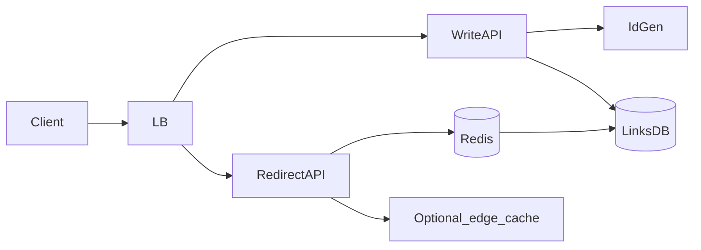

## Why this matters

URL shortener is the warm-up HLD: clear API, ID generation trade-offs, read-heavy traffic, caching, and capacity estimates.

## Definitions

- **URL shortener:** A system that maps a long URL to a short unique code and redirects `GET /{code}` to the original URL at very high read QPS.
- **Short code:** The compact unique identifier (often Base62) embedded in the short URL that looks up the long target.
- **Base62 encoding:** Encoding numeric IDs with digits + A–Z + a–z to produce short, URL-safe codes.
- **ID generation:** How codes are created — hash+truncate, DB sequence + Base62, Snowflake/ranges, or random+retry — each with uniqueness/scale trade-offs.
- **Redirect path:** The read-heavy hot path that resolves code → long URL, ideally via cache before hitting the DB.
- **TTL / expiry:** Optional lifetime after which a short link becomes invalid and may be purged.
- **Read-heavy workload:** Traffic where redirects vastly outnumber creates, driving cache and CDN design.

## Requirements

**Functional**
- `POST /shorten` `{ longUrl, ttl? }` → `{ code, shortUrl }`  
- `GET /{code}` → `302` to long URL  
- Optional: analytics, custom aliases, auth

**Non-functional**
- Low latency redirects (p99 < 50–100ms regional)  
- Extremely high read QPS vs writes  
- Codes unique; links durable unless TTL

## Back-of-envelope

Assume 100M new links/month ≈ 40 writes/sec average (spikes higher).  
Reads 100× writes → ~4k QPS average.  
7-char Base62: \(62^7 ≈ 3.5×10^{12}\) codes — plenty.  
Store ~100 bytes/row → 100M × 100B ≈ 10GB/month growth (manageable).

## Architecture



## API sketch

```http
POST /api/v1/links
{ "url": "https://example.com/a/b", "ttlDays": 30 }

→ 201 { "code": "aZ9xQ2b", "shortUrl": "https://sho.rt/aZ9xQ2b" }

GET /aZ9xQ2b
→ 302 Location: https://example.com/a/b
```

## ID generation options

| Approach | Pros | Cons |
|----------|------|------|
| Hash(URL)+truncate | Stateless | Collisions; same URL same code (maybe OK) |
| DB autoincrement + Base62 | Simple uniqueness | Hot sequence; sharding pain |
| Pre-allocated ranges / Snowflake | Scale-out friendly | Ops complexity |
| Random 64-bit + retry | Simple | Need uniqueness check |

**Base62 encode:**

```java
String toBase62(long n) {
  String alphabet = "0123456789ABCDEFGHIJKLMNOPQRSTUVWXYZabcdefghijklmnopqrstuvwxyz";
  if (n == 0) return "0";
  StringBuilder sb = new StringBuilder();
  while (n > 0) { sb.append(alphabet.charAt((int)(n % 62))); n /= 62; }
  return sb.reverse().toString();
}
```

```csharp
string ToBase62(long n) {
  const string alphabet = "0123456789ABCDEFGHIJKLMNOPQRSTUVWXYZabcdefghijklmnopqrstuvwxyz";
  if (n == 0) return "0";
  var sb = new StringBuilder();
  while (n > 0) { sb.Insert(0, alphabet[(int)(n % 62)]); n /= 62; }
  return sb.ToString();
}
```

## Data model

```text
links(code PK, long_url, created_at, expires_at, user_id?)
index: expires_at (TTL job)
```

## Redirect path (hot)

1. Lookup code in Redis  
2. On miss → DB → populate cache (TTL min(link TTL, 1 day))  
3. 302 redirect  
4. Analytics via async queue (don’t block redirect)

## Caching & CDN

- Cache **code → long URL** aggressively  
- For viral links, edge/CDN can cache 302s carefully (respect TTL)  
- Negative cache short TTL for unknown codes (anti-scan)

## Scale & failure modes

- **DB split:** write primary; read replicas for misses if needed  
- **Shard by code hash** when single DB burns  
- **Idempotent create** with hash of URL for duplicates  
- **Abuse:** rate limit create; malware URL scanning async

## Interview Q&A

- **Q:** How do you guarantee uniqueness under concurrency?
  **A:** Primary key on code; retry on conflict; or transactional range allocator.
- **Q:** Custom aliases?
  **A:** Separate namespace reserved for users; uniqueness constraint; abuse checks.
- **Q:** Analytics at 10k QPS?
  **A:** Emit event to Kafka; aggregate offline; redirect stays lean.

## Pitfalls

- Synchronous analytics on redirect path  
- Predictable sequential codes (scraping) — add salt/randomness  
- Ignoring expiry cleanup

## 60-second answer

“Clarify read-heavy redirects and uniqueness. I’d generate compact Base62 codes from a unique ID service, store code→URL in a primary DB, cache redirects in Redis, and keep analytics async. Capacity math shows storage is small; the hard part is hotspot caching and unique ID allocation.”

## Further study

- [System Design Primer](https://github.com/donnemartin/system-design-primer) — URL shortener walkthrough and capacity math
- [Base62 (Wikipedia)](https://en.wikipedia.org/wiki/Base62) — compact URL-safe short codes
- [HTTP 301 Moved Permanently (MDN)](https://developer.mozilla.org/en-US/docs/Web/HTTP/Reference/Status/301) — redirect semantics on the hot path
- [Cache (computing) (Wikipedia)](https://en.wikipedia.org/wiki/Cache_(computing)) — caching code → URL lookups

## Practice prompts

1. Design custom aliases + teams  
2. Add geo-routing for redirects  
3. Estimate Redis memory for 50M hot keys
