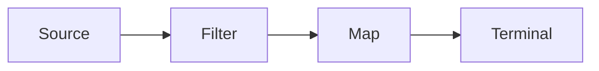

## Why this matters

Streams and Optional show up in take-homes and whiteboard refactors. Interviewers care whether you write **clear, lazy, side-effect-light pipelines** — not whether you can nest `map` ten deep.

## Definitions

- **Stream:** A lazy, possibly one-shot pipeline over elements — not a data structure you store or reuse after a terminal op.
- **Intermediate operation:** A lazy step (`filter`, `map`, `flatMap`) that builds the pipeline without running it.
- **Terminal operation:** The step that triggers execution and yields a result/side effect (`collect`, `reduce`, `forEach`).
- **flatMap:** Maps each element to a stream (or optional stream) and flattens nested results into one stream.
- **Collector:** Mutable reduction recipe for `collect` (`toList`, `groupingBy`, `counting`, custom collectors).
- **Optional:** Return-type signal for “value may be absent”; avoid as fields/parameters; prefer `map`/`flatMap`/`orElseGet` over `get()`.
- **Short-circuiting:** Ops like `anyMatch`/`findFirst` that can stop processing early once the answer is known.

## Concept

### Streams

A stream is a **pipeline** over a sequence of elements:

1. **Source** — collection, array, generator  
2. **Intermediate ops** — lazy (`filter`, `map`, `flatMap`, `distinct`, `sorted`)  
3. **Terminal op** — triggers execution (`collect`, `reduce`, `forEach`, `anyMatch`)  



Streams are not data structures. They don’t store elements; they compute on demand (unless stateful ops force buffering).

### Optional

`Optional<T>` is a **return-type signal** for “value may be absent” — not a field type, not a substitute for every null check.

```java
Optional<User> find(String id); // good API signal
```

Prefer:

- `map` / `flatMap` / `filter`  
- `orElse` / `orElseGet` / `orElseThrow`  
- Avoid `get()` without guard; avoid `Optional` parameters  

## Worked example 1 — Classic map/filter/collect

```java
List<String> names = users.stream()
    .filter(User::active)
    .map(User::email)
    .map(String::toLowerCase)
    .distinct()
    .sorted()
    .toList(); // Java 16+ unmodifiable
```

## Worked example 2 — flatMap and grouping

```java
Map<Department, List<Employee>> byDept = employees.stream()
    .collect(Collectors.groupingBy(Employee::department));

List<String> allSkills = employees.stream()
    .flatMap(e -> e.skills().stream())
    .distinct()
    .toList();
```

```java
Map<String, Long> counts = words.stream()
    .collect(Collectors.groupingBy(w -> w, Collectors.counting()));
```

## Worked example 3 — reduce vs collect

```java
int sum = nums.stream().mapToInt(Integer::intValue).sum();

OptionalInt max = nums.stream().mapToInt(Integer::intValue).max();

String joined = list.stream().collect(Collectors.joining(", "));
```

Prefer specialized collectors/`IntStream` over manual `reduce` for common cases.

## Worked example 4 — Optional chaining

```java
String city = findUser(id)
    .flatMap(User::address)
    .map(Address::city)
    .orElse("unknown");
```

```java
// Prefer orElseGet for expensive defaults
User user = repo.findById(id)
    .orElseGet(() -> User.anonymous());
```

`orElse(compute())` always computes the default — even on hit. `orElseGet` is lazy.

## Parallel streams (use sparingly)

```java
long count = bigList.parallelStream().filter(this::predicate).count();
```

Only for large CPU-bound workloads with fork-join-friendly ops. Avoid on shared mutable state, small lists, or blocking I/O. Default: sequential.

## Interview Q&A

- **Q:** Lazy vs eager?  
  **A:** Intermediate ops are lazy; nothing runs until a terminal op. That enables fusion and short-circuiting (`findFirst`, `anyMatch`).
- **Q:** `map` vs `flatMap`?  
  **A:** `map` 1→1; `flatMap` 1→many (flatten nested streams / Optional).
- **Q:** When not to use streams?  
  **A:** Complex imperative logic, early exits with heavy mutation, or when a simple loop is clearer and faster.
- **Q:** Should Optional be a field?  
  **A:** No — use empty collections or nullable fields carefully; Optional is for return types.
- **Q:** Checked exceptions in lambdas?  
  **A:** Functional interfaces don’t declare checked exceptions — wrap/translate or use helpers.
- **Q:** `findFirst` vs `findAny`?  
  **A:** `findFirst` respects encounter order; `findAny` is freer for parallel pipelines.

## Pitfalls

- Side effects inside `map`/`filter` (hard to test, breaks parallelism assumptions)  
- Multiple terminal ops on one stream (streams are single-use)  
- `Collectiors.toMap` without merge function when duplicate keys exist  
- Forgetting that `sorted` / `distinct` are stateful and can be expensive  
- Using `Optional.get()` blindly  
- Returning `null` from a method typed as `Optional`  
- Parallel streams on tiny collections “for speed”

## 60-second answer

“Streams are lazy pipelines: source, intermediate ops, one terminal collect/reduce. I keep lambdas pure, use flatMap for nested data, and pick collectors for grouping/counting. Optional is a return-type signal — I chain with map/flatMap and orElseGet, and I don’t use it for fields or parameters.”

## Further study

- [java.util.stream package](https://docs.oracle.com/en/java/javase/21/docs/api/java.base/java/util/stream/package-summary.html) — Stream ops and collector contracts
- [Optional API](https://docs.oracle.com/en/java/javase/21/docs/api/java.base/java/util/Optional.html) — intended usage and anti-patterns to avoid
- [Aggregate Operations tutorial](https://docs.oracle.com/javase/tutorial/collections/streams/index.html) — pipelines, laziness, and collectors
- [Collectors API](https://docs.oracle.com/en/java/javase/21/docs/api/java.base/java/util/stream/Collectors.html) — grouping, partitioning, and downstream collectors

## Practice prompts

1. Rewrite a nested for-loop group-by into `Collectors.groupingBy`  
2. Flatten `List<Order>` → distinct product IDs with `flatMap`  
3. Find bugs in an `Optional` API that uses `get` and `orElse(expensive())`  
4. Explain when you’d refuse parallelStream in a code review
