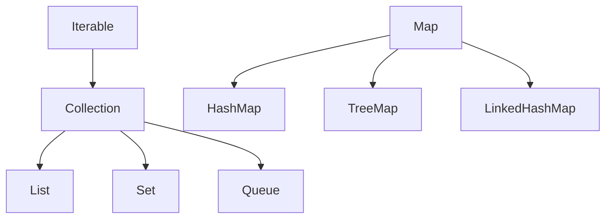

## Why this matters

Collections questions never die: `HashMap` internals, when `ArrayList` beats `LinkedList`, and picking the right concurrent structure. Strong answers show you choose structures by **access pattern and complexity**, not habit.

## Definitions

- **List:** An ordered, indexable collection that allows duplicates (`ArrayList` is the default growable array).
- **Set:** A collection of unique elements; order is undefined unless you choose sorted (`TreeSet`) or insertion-ordered (`LinkedHashSet`).
- **Map:** A key→value store; keys must obey `equals`/`hashCode` (or a comparator for sorted maps).
- **HashMap:** Average O(1) get/put via hash bins; bins may treeify under heavy collision (Java 8+).
- **Load factor:** Fill ratio that triggers `HashMap` resize (default 0.75) — trade memory vs collision chains.
- **LinkedHashMap:** Hash map that also tracks insertion (or access) order; common building block for simple LRU caches.
- **ConcurrentHashMap:** Thread-safe map allowing concurrent reads/writes without locking the entire table; null keys/values are forbidden.

## Concept

The Collections Framework splits into:

- **List** — ordered, indexable, allows duplicates  
- **Set** — unique elements  
- **Map** — key → value (not a `Collection`, but central)  
- **Queue / Deque** — FIFO / double-ended  



### Cheat sheet

| Type | Impl | Get / Contains | Add / Put | Notes |
|------|------|----------------|-----------|-------|
| List | `ArrayList` | O(1) index | Amortized O(1) end | Default list |
| List | `LinkedList` | O(n) | O(1) ends | Rarely wins on modern CPUs |
| Map | `HashMap` | avg O(1) | avg O(1) | Unordered |
| Map | `LinkedHashMap` | avg O(1) | avg O(1) | Insertion or access order |
| Map | `TreeMap` | O(log n) | O(log n) | Sorted by key |
| Set | `HashSet` | avg O(1) | avg O(1) | Backed by `HashMap` |
| Set | `TreeSet` | O(log n) | O(log n) | Sorted |
| Queue | `ArrayDeque` | — | O(1) ends | Prefer over `Stack`/`LinkedList` queue |
| Concurrent | `ConcurrentHashMap` | — | — | CAS / fine-grained |

### HashMap internals (say this out loud)

1. Table of bins; index ≈ `(n - 1) & hash`  
2. Collisions: linked list → **treeify** at threshold (Java 8+)  
3. Load factor **0.75** → resize (rehash) when size exceeds capacity × load  
4. Keys need consistent `equals` / `hashCode`  
5. Allows **one null key**; values may be null  

### ArrayList vs LinkedList

- `ArrayList`: contiguous array, great cache locality, O(1) random access  
- `LinkedList`: node hopping, poor locality; O(1) only at known ends/nodes  
- Interview default: **ArrayList** unless you have a measured deque-at-ends story (then often `ArrayDeque`)

### Ordering maps/sets

- Need insertion order → `LinkedHashMap` / `LinkedHashSet`  
- Need sorted keys → `TreeMap` / `TreeSet` (or sort a list once)  
- Need LRU → `LinkedHashMap` with `removeEldestEntry` and access-order mode  

## Worked example 1 — Frequency count + top-K

```java
Map<String, Integer> counts = new HashMap<>();
for (String w : words) {
  counts.merge(w, 1, Integer::sum);
}

List<String> top = counts.entrySet().stream()
    .sorted(Map.Entry.<String, Integer>comparingByValue().reversed())
    .limit(3)
    .map(Map.Entry::getKey)
    .toList();
```

For large K-selection under memory pressure, prefer a **min-heap of size K** over full sort.

## Worked example 2 — LRU cache with LinkedHashMap

```java
public final class LruCache<K, V> extends LinkedHashMap<K, V> {
  private final int capacity;

  public LruCache(int capacity) {
    super(capacity, 0.75f, true); // access-order
    this.capacity = capacity;
  }

  @Override
  protected boolean removeEldestEntry(Map.Entry<K, V> eldest) {
    return size() > capacity;
  }
}
```

## Worked example 3 — Safe removal while iterating

```java
List<String> names = new ArrayList<>(List.of("a", "", "b", ""));
Iterator<String> it = names.iterator();
while (it.hasNext()) {
  if (it.next().isEmpty()) it.remove(); // OK — structural change via iterator
}
// names.removeIf(String::isEmpty); // clearer modern form
```

Fail-fast iterators on `ArrayList`/`HashMap` throw `ConcurrentModificationException` if the collection is structurally modified outside the iterator during traversal.

## Worked example 4 — Concurrent counts

```java
ConcurrentHashMap<String, LongAdder> m = new ConcurrentHashMap<>();
m.computeIfAbsent(key, k -> new LongAdder()).increment();
```

Prefer `computeIfAbsent` / `merge` over check-then-act races. `ConcurrentHashMap` **disallows null** keys/values.

## Choosing under concurrency

| Need | Pick |
|------|------|
| Concurrent map | `ConcurrentHashMap` |
| Rare writes, many reads on a list | `CopyOnWriteArrayList` |
| Producer/consumer handoff | `BlockingQueue` (`ArrayBlockingQueue`, `LinkedBlockingQueue`) |
| Simple sync wrapper | `Collections.synchronizedMap` — coarse lock, usually inferior to CHM |

## Interview Q&A

- **Q:** Why not `LinkedList` by default?  
  **A:** Pointer chasing kills CPU caches; `ArrayList` wins for almost all real workloads.
- **Q:** `HashMap` vs `Hashtable`?  
  **A:** `Hashtable` is legacy synchronized; use `HashMap` or `ConcurrentHashMap`.
- **Q:** How does `HashSet` work?  
  **A:** It’s a `HashMap` where elements are keys and a dummy value is stored.
- **Q:** When `TreeMap`?  
  **A:** Need sorted keys, range queries (`subMap`), or navigable operations — at O(log n).
- **Q:** CHM vs `Collections.synchronizedMap`?  
  **A:** CHM allows concurrent readers/writers with finer coordination; synchronized map locks the entire map on every call.
- **Q:** IdentityHashMap?  
  **A:** Uses `==` / identity hash — special cases (e.g. serialization graphs), not general equality.

## Pitfalls

- Mutable keys after insert into hash structures  
- Assuming iteration order on plain `HashMap`  
- Using raw types (`List` without `<T>`)  
- Inconsistent `compareTo` vs `equals` in `TreeMap` keys  
- Resizing/`get` under wrong concurrency assumptions on non-thread-safe maps  
- Building LRU by hand with two structures when `LinkedHashMap` suffices for interviews

## 60-second answer

“I default to ArrayList and HashMap. I can explain bins, collisions, treeify, and 0.75 resize. I pick LinkedHashMap for order/LRU, TreeMap for sorted keys, and ConcurrentHashMap for concurrent maps. equals/hashCode contracts are non-negotiable, and I remove via iterator or removeIf — never with a naive for-each delete.”

## Further study

- [java.util package summary](https://docs.oracle.com/en/java/javase/21/docs/api/java.base/java/util/package-summary.html) — Collections Framework interfaces and implementations
- [HashMap API](https://docs.oracle.com/en/java/javase/21/docs/api/java.base/java/util/HashMap.html) — contract details interviewers probe (nulls, resize, iteration)
- [Collections tutorial](https://docs.oracle.com/javase/tutorial/collections/index.html) — List/Set/Map mental model and algorithms
- [ConcurrentHashMap API](https://docs.oracle.com/en/java/javase/21/docs/api/java.base/java/util/concurrent/ConcurrentHashMap.html) — concurrent map semantics vs synchronized wrappers

## Practice prompts

1. Implement LRU with `LinkedHashMap.removeEldestEntry` and write a concurrency caveat  
2. Group anagrams with sort-key vs character-count key — compare complexity  
3. Explain why `ConcurrentHashMap` rejects nulls  
4. Design top-K frequent words with HashMap + heap
