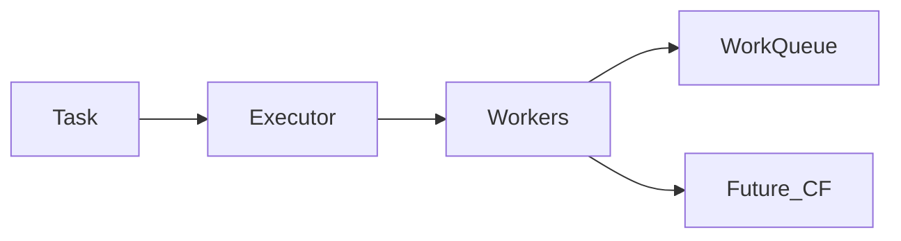

## Why this matters

Concurrency questions separate people who sprinkled `synchronized` once from engineers who’ve shipped thread-safe services under load. Interviewers want **visibility + atomicity + bounded execution**, not buzzwords.

## Definitions

- **Happens-before:** JMM ordering edge: if A happens-before B, A’s writes are visible to B and cannot be reordered past that edge.
- **Atomicity:** A compound action (check-then-act, read-modify-write) appears indivisible — no partial interleaving from other threads.
- **Visibility:** A write on one thread becomes reliably observable to other threads (not stuck in CPU caches/registers).
- **volatile:** Ensures visibility/ordering for individual reads/writes; does **not** make `i++` atomic.
- **ExecutorService:** Managed pool API for submitting tasks and getting `Future`s instead of spawning unbounded raw threads.
- **CompletableFuture:** Composable async result for chaining, combining, timeouts, and completion stages on chosen executors.
- **Virtual thread:** Lightweight JVM thread (Project Loom) meant for huge numbers of concurrent blocking tasks; still watch pinning.

## Concept

### The two problems

1. **Atomicity** — compound actions (`check-then-act`, read-modify-write) must not interleave incorrectly  
2. **Visibility** — a write on thread A must become visible to thread B  

Java’s memory story is built on **happens-before** edges: monitor unlock → later lock, volatile write → later read, thread start/join, successful CAS, etc.

| Tool | Provides |
|------|----------|
| `synchronized` | Mutual exclusion + visibility |
| `volatile` | Visibility for a single field (not atomic RMW) |
| `Atomic*` / `LongAdder` | Lock-free atomic updates |
| `j.u.c` utilities | Higher-level correct patterns |

Prefer **java.util.concurrent** over inventing atomics with `volatile` alone.



## Worked example 1 — ExecutorService basics

```java
ExecutorService pool = Executors.newFixedThreadPool(8);
try {
  Future<Integer> f = pool.submit(() -> compute());
  int v = f.get(1, TimeUnit.SECONDS);
} finally {
  pool.shutdown();
  pool.awaitTermination(5, TimeUnit.SECONDS);
}
```

| Factory | Risk / use |
|---------|------------|
| `newFixedThreadPool` | Bounded — good default |
| `newCachedThreadPool` | Can explode under load |
| `newSingleThreadExecutor` | Serial pipeline |
| `newScheduledThreadPool` | Delays / periodic work |
| `ForkJoinPool.commonPool` | Don’t block with JDBC / HTTP |

Production code often uses explicit `ThreadPoolExecutor` with **bounded queue + rejection policy**.

```java
ThreadPoolExecutor exec = new ThreadPoolExecutor(
    4, 8, 60, TimeUnit.SECONDS,
    new ArrayBlockingQueue<>(100),
    new ThreadPoolExecutor.CallerRunsPolicy());
```

## Worked example 2 — CompletableFuture composition

```java
ExecutorService pool = Executors.newFixedThreadPool(8);

CompletableFuture<User> user =
    CompletableFuture.supplyAsync(() -> loadUser(id), pool);
CompletableFuture<Prefs> prefs =
    CompletableFuture.supplyAsync(() -> loadPrefs(id), pool);

UserView view = user
    .thenCombine(prefs, UserView::new)
    .orTimeout(2, TimeUnit.SECONDS)
    .join();
```

Always pass an **application executor** for blocking work — don’t overload the common pool.

## Worked example 3 — synchronized vs explicit Lock

```java
private final Object monitor = new Object();
private int count;

void inc() {
  synchronized (monitor) {
    count++;
  }
}
```

```java
private final ReentrantLock lock = new ReentrantLock();

void update() {
  if (!lock.tryLock(100, TimeUnit.MILLISECONDS)) {
    throw new IllegalStateException("busy");
  }
  try {
    // critical section
  } finally {
    lock.unlock();
  }
}
```

Use explicit locks for tryLock/timeouts, fairness knobs, or multiple `Condition`s. Otherwise `synchronized` is fine and clearer.

## Worked example 4 — Atomic and concurrent collections

```java
AtomicInteger inFlight = new AtomicInteger();
inFlight.incrementAndGet();

ConcurrentHashMap<String, LongAdder> counts = new ConcurrentHashMap<>();
counts.computeIfAbsent(key, k -> new LongAdder()).increment();

BlockingQueue<Job> q = new ArrayBlockingQueue<>(256);
q.put(job);          // producer
Job next = q.take();  // consumer
```

| Structure | When |
|-----------|------|
| `ConcurrentHashMap` | Concurrent map; no nulls |
| `CopyOnWriteArrayList` | Rare writes, many reads |
| `BlockingQueue` | Producer/consumer pipelines |
| `AtomicInteger` / `LongAdder` | Counters (adder for high contention) |

## Visibility pitfalls

```java
// Broken: ++ is read-modify-write
volatile int x;
void bump() { x++; } // NOT thread-safe

// Fixed
final AtomicInteger x = new AtomicInteger();
void bump() { x.incrementAndGet(); }
```

Double-checked locking requires `volatile` on the field (historical interview favorite).

## ThreadLocal

Useful for request context, but **clear it** when using thread pools — otherwise values leak across requests.

```java
try {
  CONTEXT.set(ctx);
  chain.doFilter(req, res);
} finally {
  CONTEXT.remove();
}
```

## Virtual threads (Java 21+)

Virtual threads make **blocking** cheaper: many waiting tasks ≠ many OS threads. Still avoid pinning (long `synchronized` / native calls) in hot paths. Mention if the role’s JDK is 21+.

## Interview Q&A

- **Q:** Is `volatile++` safe?  
  **A:** No — visibility ≠ atomicity. Use `AtomicInteger`.
- **Q:** happens-before in one sentence?  
  **A:** A guarantee that memory writes before a sync point are visible to reads after a related sync point on another thread.
- **Q:** When `ConcurrentHashMap` vs synchronizing a `HashMap`?  
  **A:** CHM for concurrent access patterns; synchronized map is a coarse global lock.
- **Q:** Why bounded queues matter?  
  **A:** Unbounded work queues turn load spikes into OOM; backpressure/rejection is a feature.
- **Q:** `CompletableFuture.get` vs `join`?  
  **A:** `get` throws checked `Exception`; `join` wraps in unchecked. Prefer timeouts either way.
- **Q:** Deadlock basics?  
  **A:** Circular wait on locks — order lock acquisition, use tryLock timeouts, keep critical sections small.

## Pitfalls

- `Executors.newCachedThreadPool` + unbounded growth under spike  
- Blocking the common `ForkJoinPool` with I/O  
- Calling foreign/slow code while holding a lock  
- Forgetting `shutdown` / leaking pools in tests  
- Fire-and-forget tasks without exception handling  
- Using `ThreadLocal` in pools without `remove`  
- Assuming `volatile` fixes compound actions

## 60-second answer

“I structure concurrency around bounded executors and java.util.concurrent. I reason with happens-before: synchronized/volatile/atomics for visibility and atomicity. I compose async work with CompletableFuture on app pools, use CHM and BlockingQueue instead of coarse synchronized maps, and I’m careful with ThreadLocal and virtual-thread pinning.”

## Further study

- [java.util.concurrent package](https://docs.oracle.com/en/java/javase/21/docs/api/java.base/java/util/concurrent/package-summary.html) — executors, queues, atomics, and synchronizers
- [CompletableFuture API](https://docs.oracle.com/en/java/javase/21/docs/api/java.base/java/util/concurrent/CompletableFuture.html) — composition patterns used in services
- [JEP 444: Virtual Threads](https://openjdk.org/jeps/444) — Loom model, pinning, and when virtual threads help
- [Java Memory Model (JSR-133 FAQ)](https://www.cs.umd.edu/~pugh/java/memoryModel/jsr-133-faq.html) — happens-before intuition beyond slogans

## Practice prompts

1. Design a bounded worker pool with rejection policy and metrics  
2. Implement timeout + partial success for N parallel HTTP calls  
3. Find the race in unsynchronized lazy singleton init and fix it  
4. Explain stampede protection for a cache using CHM compute
