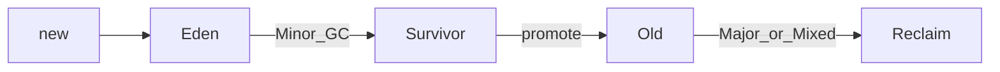

## Why this matters

You don’t need to be a GC engineer — you need to explain **allocation → collection → pause**, pick a collector story, and diagnose leaks vs undersized heaps. That signals production ownership.

## Definitions

- **Heap:** Runtime region where Java objects/arrays are allocated and reclaimed by the garbage collector.
- **Generational hypothesis:** Most objects die young — so collectors segregate young (Eden/Survivors) vs old generations.
- **Minor / young GC:** Collection focused on the young generation; usually cheaper than old-gen work.
- **Full GC:** Expensive collection involving old generation (and often more); frequent Full GCs are a production smell.
- **Metaspace:** Native memory for class metadata (replaced PermGen); can OOM independently of the Java heap.
- **G1 GC:** Region-based collector balancing throughput and pause goals; common modern HotSpot default.
- **ZGC / low-pause collectors:** Collectors optimized for very short pause times at the cost of different CPU/memory trade-offs.
- **Escape analysis:** JIT optimization that may stack-allocate or scalar-replace objects that never escape a method.

## Concept

### Runtime areas (interview sketch)

| Area | Holds |
|------|-------|
| **Heap** | Objects / arrays |
| **Stacks** | Per-thread frames, locals, return addresses |
| **Metaspace** | Class metadata (native; replaced PermGen) |
| **Code cache** | JIT-compiled code |
| **Direct / native** | NIO direct buffers, threads, JNI |

Most GC talk is about the **heap**. Native OOMs can happen with plenty of free `-Xmx`.

### Generational hypothesis

Most objects die young. Collectors split the heap:

```text
Young: Eden + Survivor (S0/S1)
Old / Tenured: long-lived objects
```



- **Minor GC** — collect young gen; usually short  
- **Mixed / Major / Full** — heavier; frequent Full GC is a red flag  

Promotion: objects that survive enough collections move to old gen.

### Collectors to know

| Collector | Character |
|-----------|-----------|
| **G1** | Common default; region-based; balances throughput & pause goals |
| **ZGC** / **Shenandoah** | Ultra-low pause; great for large heaps / latency SLOs |
| Parallel | Throughput-oriented (batch) |
| Serial | Single-thread; tiny tools/containers only |

Say: “I’d pick based on latency SLO and heap size, validate with GC logs under load — not from blog defaults alone.”

### Allocation & escape analysis

```java
// Hot path: avoid needless temporary objects
ByteBuffer buf = ByteBuffer.allocateDirect(8 * 1024);
```

JIT **escape analysis** may scalar-replace or stack-allocate objects that never leave a method — one reason microbenchmarks lie without JMH.

## Worked example 1 — Talking through a request allocation

```java
public OrderDto getOrder(String id) {
  Order order = repo.find(id);           // objects from DB layer
  return mapper.toDto(order);            // short-lived DTOs → Eden
}
```

Narrative: request creates many short-lived objects → Eden fills → minor GC → survivors promote if retained (caches, sessions, static maps).

## Worked example 2 — Symptoms → hypotheses

| Symptom | Likely cause | Next step |
|---------|--------------|-----------|
| Frequent minor GC, healthy latency | High allocation rate | Profile allocations; reduce churn |
| Rising old gen, never reclaimed | Memory leak / unbounded cache | Heap dump + MAT |
| Long pauses | Collector/heap mismatch, thrashing | GC logs; consider G1 pause goal / ZGC |
| OOM with free heap | Native leak / metaspace / threads | Native tracking, thread count |

## Worked example 3 — Diagnosis toolkit

```bash
# sizing
-Xms512m -Xmx512m

# GC logging (JDK 9+)
-Xlog:gc*:file=gc.log:time,uptime,level,tags

# heap dump on OOM
-XX:+HeapDumpOnOutOfMemoryError
-XX:HeapDumpPath=/var/log/app
```

Tools: Eclipse MAT / VisualVM / async-profiler / JFR.  
Thread dumps help when the app “hangs” under GC pressure (threads in `GC` / allocation stalls).

## Tuning principles (keep humble)

1. Fix **leaks and allocation churn** before exotic flags  
2. Set `-Xms` ≈ `-Xmx` in containers to avoid resize pauses  
3. Size heap from real load + headroom, not “max the machine”  
4. Use container-aware JDK settings (RAM percentages)  
5. For latency SLOs, evaluate G1 pause targets or ZGC — **measure**

```text
Example G1 direction (illustrative, not cargo-cult):
-XX:+UseG1GC -XX:MaxGCPauseMillis=200
```

## Interview Q&A

- **Q:** Stack vs heap?  
  **A:** Locals/frames on stack; objects on heap (escape analysis may eliminate heap allocs).
- **Q:** What causes frequent Full GC?  
  **A:** Heap too small, memory leaks, huge object churn, mis-tuned ratios, or explicit `System.gc()` abuse.
- **Q:** Metaspace OOM?  
  **A:** Classloader leaks (redeploys), excessive dynamic proxies/classes — not classic heap.
- **Q:** Why generational GC?  
  **A:** Weak generational hypothesis: most objects die young, so collecting young space is cheaper.
- **Q:** G1 vs ZGC?  
  **A:** G1 is a strong default; ZGC targets multi-ms pauses on large heaps at some throughput/CPU cost.
- **Q:** How do you prove a leak?  
  **A:** Old gen / retained heap grows across GCs under stable load; dump → dominator tree → GC roots.

## Pitfalls

- Huge heaps without latency goals  
- Unbounded caches (`static ConcurrentHashMap`)  
- Ignoring GC logs until production pages  
- Blaming GC for slow DB calls (always check traces)  
- Calling `System.gc()` in app code  
- Assuming `-Xmx` covers native memory  
- Copying JVM flags from unrelated services

## 60-second answer

“Objects live on the heap; generational GC assumes most die young in Eden. I’d size heaps from load tests, watch GC logs for pause and old-gen growth, and use heap dumps for leaks. Collector choice is SLO-driven — G1 by default, ZGC when pause latency dominates — always validated with evidence.”

## Further study

- [HotSpot GC tuning guide](https://docs.oracle.com/en/java/javase/21/gctuning/) — generations, collectors, and operational flags
- [JEP 333: ZGC](https://openjdk.org/jeps/333) — low-pause collector design goals (context for pause-sensitive SLOs)
- [MemoryMXBean](https://docs.oracle.com/en/java/javase/21/docs/api/java.management/java/lang/management/MemoryMXBean.html) — programmatic heap/non-heap monitoring hooks
- [JEP 439: Generational ZGC](https://openjdk.org/jeps/439) — modern low-pause GC evolution beyond classic G1 trade-offs

## Practice prompts

1. Interpret a chart: old gen ratchets up over hours at constant RPS  
2. Choose heap/collector for a 2GB container with p99 < 50ms API SLO  
3. Explain escape analysis and why a microbenchmark might “allocate nothing”  
4. List three non-heap OOM causes and how you’d confirm each
