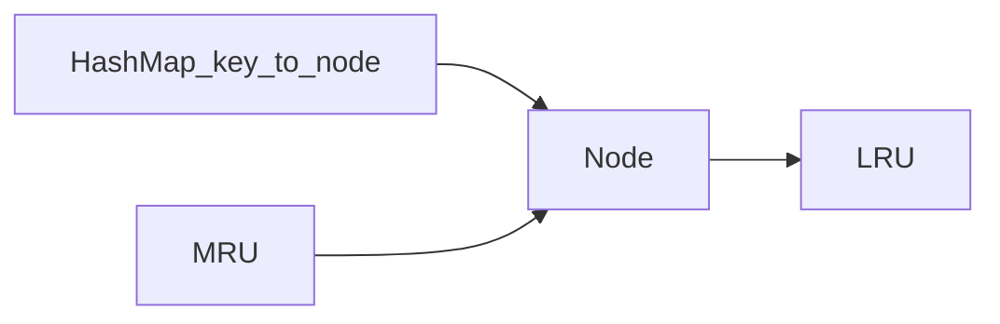

## Why this matters

LRU combines data structures with clean class design — extremely common interview.

## Definitions

- **LRU cache:** A fixed-capacity key-value store that evicts the least recently used entry when full, with average O(1) `get` and `put`.
- **Least recently used (LRU):** The eviction policy that removes the entry that has not been accessed for the longest time.
- **Hash map + doubly linked list:** The classic O(1) structure — map locates nodes by key; list orders entries from most to least recently used.
- **MRU (most recently used):** The head of the list; every successful get/put moves or inserts the node here.
- **Eviction:** Removing the tail (LRU) node from both the list and the map when capacity is exceeded.
- **Capacity:** The maximum number of entries the cache may hold before eviction starts.
- **Recency update:** Treating both `get` and `put` as accesses that refresh an entry’s position in the recency order.

## Requirements

- `get(key)` / `put(key,value)` average O(1)  
- Evict least recently used when over capacity  
- Thread-safety optional follow-up

## Structure



## Implementation sketch

```java
class LRUCache {
  static class Node {
    int k, v; Node prev, next;
    Node(int k, int v) { this.k = k; this.v = v; }
  }
  private final int cap;
  private final Map<Integer, Node> map = new HashMap<>();
  private final Node head = new Node(0, 0), tail = new Node(0, 0);

  LRUCache(int capacity) {
    cap = capacity; head.next = tail; tail.prev = head;
  }

  public int get(int key) {
    Node n = map.get(key);
    if (n == null) return -1;
    moveToHead(n);
    return n.v;
  }

  public void put(int key, int value) {
    Node n = map.get(key);
    if (n != null) { n.v = value; moveToHead(n); return; }
    n = new Node(key, value);
    map.put(key, n); addToHead(n);
    if (map.size() > cap) {
      Node lru = tail.prev;
      remove(lru); map.remove(lru.k);
    }
  }

  private void moveToHead(Node n) { remove(n); addToHead(n); }
  private void addToHead(Node n) {
    n.next = head.next; n.prev = head; head.next.prev = n; head.next = n;
  }
  private void remove(Node n) { n.prev.next = n.next; n.next.prev = n.prev; }
}
```

```csharp
class LRUCache {
  class Node { public int K, V; public Node? Prev, Next; public Node(int k, int v){K=k;V=v;} }
  private readonly int _cap;
  private readonly Dictionary<int, Node> _map = new();
  private readonly Node _head = new(0,0), _tail = new(0,0);
  public LRUCache(int capacity) { _cap = capacity; _head.Next = _tail; _tail.Prev = _head; }
  public int Get(int key) {
    if (!_map.TryGetValue(key, out var n)) return -1;
    MoveToHead(n); return n.V;
  }
  public void Put(int key, int value) {
    if (_map.TryGetValue(key, out var n)) { n.V = value; MoveToHead(n); return; }
    n = new Node(key, value); _map[key] = n; AddToHead(n);
    if (_map.Count > _cap) { var lru = _tail.Prev!; Remove(lru); _map.Remove(lru.K); }
  }
  void MoveToHead(Node n) { Remove(n); AddToHead(n); }
  void AddToHead(Node n) { n.Next = _head.Next; n.Prev = _head; _head.Next!.Prev = n; _head.Next = n; }
  void Remove(Node n) { n.Prev!.Next = n.Next; n.Next!.Prev = n.Prev; }
}
```

## Concurrency follow-up

- `ConcurrentHashMap` + locking per structure, or  
- Segmented LRUs, or read `LinkedHashMap` access-order (Java) with synchronization

## Interview Q&A

- **Q:** Why not just `LinkedHashMap`?
  **A:** Fine to mention as language sugar; still explain the underlying list+map.
- **Q:** LFU?
  **A:** Need frequency buckets — harder; discuss if asked.

## Pitfalls

- Forgetting to update map on eviction  
- Breaking list links order when moving nodes

## 60-second answer

“Map key→node for O(1) lookup; doubly linked list orders recency. get/put move node to head; overflow evicts tail. That’s O(1) average LRU.”

## Further study

- [Cache replacement policies — LRU (Wikipedia)](https://en.wikipedia.org/wiki/Cache_replacement_policies#Least_recently_used_(LRU)) — eviction semantics interviews expect
- [Hash table (Wikipedia)](https://en.wikipedia.org/wiki/Hash_table) — O(1) key → node lookup half of LRU
- [Doubly linked list (Wikipedia)](https://en.wikipedia.org/wiki/Doubly_linked_list) — O(1) move-to-front / evict-tail
- [LinkedHashMap (Java SE)](https://docs.oracle.com/en/java/javase/17/docs/api/java.base/java/util/LinkedHashMap.html) — Java access-order map related to LRU

## Practice prompts

1. Add TTL to entries  
2. Design LFU cache  
3. Thread-safe LRU for a web cache
