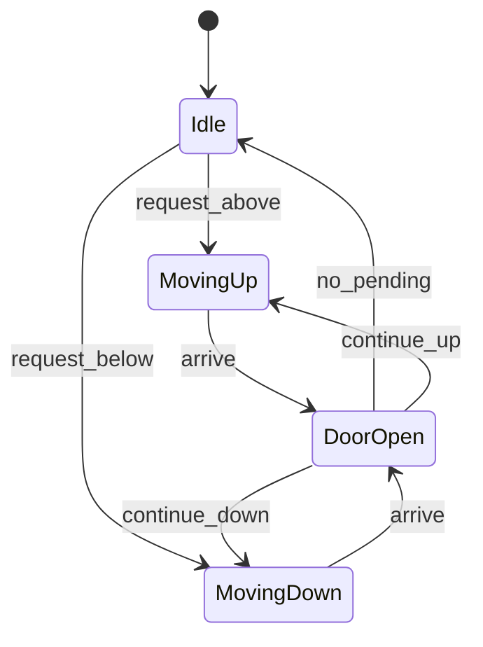

## Why this matters

Elevators test state machines, concurrency of requests, and scheduling strategies.

## Definitions

- **Elevator system:** An LLD that accepts floor requests, assigns them to cars, and moves elevators while respecting direction, doors, and policy.
- **Elevator state machine:** The lifecycle of a car — typically idle, moving up/down, and door open — that drives when new targets are accepted.
- **External request:** A hall call with floor and desired direction (up/down) from outside the car.
- **Internal request:** A destination floor selected inside the car that the elevator must visit.
- **Elevator controller:** The component that assigns incoming requests to elevators using a cost function (nearest idle, same-direction, etc.).
- **SCAN / LOOK:** A scheduling strategy that continues in the current direction clearing requests before reversing, reducing thrashing.
- **Zoning:** Assigning elevators to floor ranges (e.g., rush hour) to cut contention and improve throughput.

## Requirements

- N elevators, M floors  
- External up/down calls + internal destination buttons  
- Show assignment strategy (nearest, SCAN, zoning)

## States

`IDLE`, `MOVING_UP`, `MOVING_DOWN`, `DOOR_OPEN`



## Core types

```java
enum Direction { UP, DOWN, IDLE }
class Request { int floor; Direction dir; } // external may include dir
class Elevator {
  int id, floor; Direction dir; NavigableSet<Integer> targets = new TreeSet<>();
  void addTarget(int f) { targets.add(f); }
  void step() { /* move one floor toward next target */ }
}
class ElevatorController {
  List<Elevator> elevators;
  Elevator assign(Request r) {
    // pick idle nearest or continuing in same direction
    return elevators.stream().min(Comparator.comparingInt(e -> cost(e, r))).orElseThrow();
  }
  int cost(Elevator e, Request r) { /* distance + direction penalty */ return Math.abs(e.floor - r.floor); }
}
```

```csharp
enum Direction { Up, Down, Idle }
record Request(int Floor, Direction Dir);
class Elevator {
  public int Id, Floor; public Direction Dir;
  public SortedSet<int> Targets = new SortedSet<int>();
}
class ElevatorController {
  public List<Elevator> Elevators = new();
  public Elevator Assign(Request r) =>
    Elevators.OrderBy(e => Math.Abs(e.Floor - r.Floor)).First();
}
```

## Scheduling talk track

- **SCAN/LOOK:** continue direction, clear requests, then reverse  
- **Zoning:** elevator owns floor ranges in rush hour  
- Avoid thrashing with pending queue per elevator

## Interview Q&A

- **Q:** Concurrency?
  **A:** Requests enter a thread-safe queue; single scheduler thread assigns; each car runs a worker.
- **Q:** How to test?
  **A:** Simulate timeline of requests; assert order and no skipped floors incorrectly.

## Pitfalls

- No direction awareness (elevator goes away from caller uselessly)  
- Over-engineering ML predictors in a 45-minute round

## 60-second answer

“I’d model cars as state machines with sorted target sets, and a controller that assigns requests by cost (distance + direction). SCAN-style motion clears work in one direction before reversing.”

## Further study

- [Elevator algorithm (Wikipedia)](https://en.wikipedia.org/wiki/Elevator_algorithm) — SCAN-style scheduling for disk/elevator motion
- [Finite-state machine (Wikipedia)](https://en.wikipedia.org/wiki/Finite-state_machine) — modeling car states (idle/moving/doors)
- [Design Patterns (Refactoring Guru)](https://refactoring.guru/design-patterns) — Strategy/state-style assignment policies
- [Scheduling (computing) (Wikipedia)](https://en.wikipedia.org/wiki/Scheduling_(computing)) — request assignment and fairness trade-offs

## Practice prompts

1. Add maintenance mode  
2. VIP / fire override  
3. Compare SCAN vs nearest-idle under load
