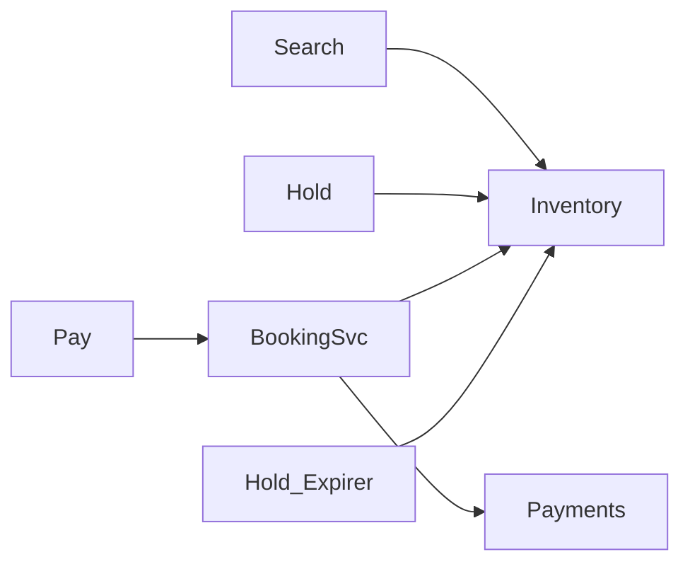

## Why this matters

Booking systems combine inventory, temporary holds, payments, and race conditions — senior LLD territory.

## Definitions

- **Booking system:** An LLD that manages scarce inventory (seats/rooms), temporary holds, payment confirmation, and cancellation without double-booking.
- **Inventory:** The authoritative store of bookable units and status (free, held, sold), protected by optimistic or pessimistic concurrency control.
- **Hold:** A time-bounded soft reservation that locks a seat/room for checkout while payment completes, then expires if not confirmed.
- **Optimistic concurrency:** Updating inventory with a version/CAS check so only one concurrent claim of a free seat succeeds.
- **Pessimistic locking:** Locking a row (`SELECT … FOR UPDATE`) so competing transactions wait rather than racing on the same seat.
- **Idempotency key:** A client-supplied unique key that makes confirm/pay retries safe so the same request cannot create duplicate bookings.
- **Hold expiry:** A background job that frees seats whose hold TTL elapsed without a confirmed booking.

## Requirements

- Search availability  
- Hold seat/room for T minutes  
- Confirm with payment → booking  
- Cancel / expire holds

## Design



## Inventory concurrency

```java
// Optimistic: version column on seat row
// UPDATE seats SET status='HELD', hold_until=?, version=version+1
// WHERE id=? AND status='FREE' AND version=?
```

```csharp
// Same SQL via EF execute; or serializable transaction on seat id
```

**Pessimistic:** `SELECT … FOR UPDATE` on free seat.

## Domain sketch

```java
enum SeatStatus { FREE, HELD, SOLD }
class Seat { String id; SeatStatus status; Instant holdUntil; long version; }
class HoldService {
  Hold createHold(String seatId, Duration ttl) { /* CAS free→held */ }
  void expire() { /* job frees expired holds */ }
}
class BookingService {
  Booking confirm(String holdId, PaymentIntent pay) { /* pay then sold */ }
}
```

## Failure handling

- Payment succeeds, DB fails → outbox / reconcile  
- Double booking → unique constraint on sold seat + idempotency key

## Interview Q&A

- **Q:** Why holds?
  **A:** UX + payment latency; prevent oversell during checkout.
- **Q:** Scale search?
  **A:** Denormalized availability documents / cache; inventory DB remains source of truth for commits.

## Pitfalls

- No expiry job → permanent holds  
- Confirm without checking hold ownership

## 60-second answer

“Search reads availability; booking uses short-lived holds with CAS/version checks, then payment + confirm to SOLD. Expiry workers free abandoned holds; idempotency prevents double charges.”

## Further study

- [Optimistic concurrency control (Wikipedia)](https://en.wikipedia.org/wiki/Optimistic_concurrency_control) — version/CAS seat claims
- [Idempotence (Wikipedia)](https://en.wikipedia.org/wiki/Idempotence) — safe retries on pay/confirm
- [Database transaction (Wikipedia)](https://en.wikipedia.org/wiki/Database_transaction) — atomic hold → sold transitions
- [System Design Primer](https://github.com/donnemartin/system-design-primer) — inventory and consistency patterns at scale

## Practice prompts

1. Movie ticket multipy seats atomic hold  
2. Hotel room overbooking policy  
3. Design cancel + refund flow
