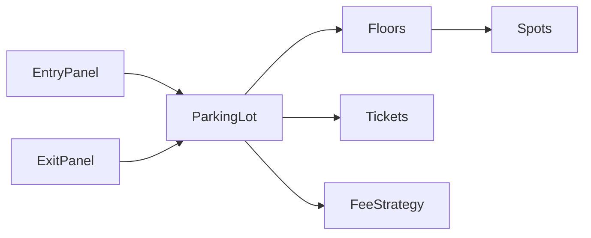

## Why this matters

Parking lot is the classic **object-modeling** interview: clarify requirements, show responsibilities, and leave extension points (EV, reserved, multi-level).

## Definitions

- **Parking lot system:** An OOP design that assigns vehicles to spots, issues tickets, and computes fees on exit while staying extensible for floors, EV, and reserved spots.
- **Parking spot:** A typed stall (motorcycle, compact, large) that holds at most one vehicle and enforces fit rules for vehicle types.
- **Ticket:** A record linking a parked vehicle to its spot and entry time, used at exit to compute the fee.
- **Fee strategy:** A pluggable policy that calculates parking cost from ticket data without changing core lot logic.
- **Spot assignment:** Finding and reserving an eligible free spot for an incoming vehicle under concurrency.
- **Entry / exit panel:** Boundary components that start parking (issue ticket) and finish parking (unpark and charge).
- **Availability index:** An optional free-list or per-type count structure that avoids scanning every spot on each park request.

## Clarify requirements (always start here)

**Functional**
- Park vehicle → issue ticket  
- Unpark with ticket → compute fee  
- Spot types: motorcycle / compact / large (map vehicle → acceptable spots)

**Optional (ask)**
- Multiple floors, EV chargers, reserved spots, pricing rules, max capacity display

**Non-functional**
- Thread-safe assignment under concurrent entries  
- In-memory OK for LLD unless they ask persistence

## High-level design



## Class sketch

```java
enum SpotType { MOTORCYCLE, COMPACT, LARGE }
enum VehicleType { MOTORCYCLE, CAR, BUS }

class Vehicle {
  final String plate;
  final VehicleType type;
  Vehicle(String plate, VehicleType type) { this.plate = plate; this.type = type; }
}

class ParkingSpot {
  final String id;
  final SpotType type;
  private Vehicle vehicle; // null if free

  synchronized boolean tryPark(Vehicle v) {
    if (vehicle != null || !fits(v)) return false;
    vehicle = v;
    return true;
  }

  synchronized Vehicle unpark() {
    Vehicle v = vehicle;
    vehicle = null;
    return v;
  }

  boolean fits(Vehicle v) {
    return switch (v.type) {
      case MOTORCYCLE -> true;
      case CAR -> type == SpotType.COMPACT || type == SpotType.LARGE;
      case BUS -> type == SpotType.LARGE;
    };
  }
}

class Ticket {
  final String id;
  final String spotId;
  final Vehicle vehicle;
  final Instant in;
  Instant out;
}

interface FeeStrategy {
  Money calculate(Ticket t);
}

class ParkingLot {
  private final List<ParkingSpot> spots;
  private final FeeStrategy fees;
  private final Map<String, Ticket> open = new ConcurrentHashMap<>();

  ParkingLot(List<ParkingSpot> spots, FeeStrategy fees) {
    this.spots = spots; this.fees = fees;
  }

  Ticket park(Vehicle v) {
    for (ParkingSpot s : spots) {
      if (s.tryPark(v)) {
        Ticket t = new Ticket(UUID.randomUUID().toString(), s.id, v, Instant.now());
        open.put(t.id, t);
        return t;
      }
    }
    throw new IllegalStateException("Lot full for vehicle type");
  }

  Money unpark(String ticketId) {
    Ticket t = open.remove(ticketId);
    if (t == null) throw new IllegalArgumentException("Unknown ticket");
    t.out = Instant.now();
    spots.stream().filter(s -> s.id.equals(t.spotId)).findFirst().ifPresent(ParkingSpot::unpark);
    return fees.calculate(t);
  }
}
```

```csharp
enum SpotType { Motorcycle, Compact, Large }
enum VehicleType { Motorcycle, Car, Bus }

sealed record Vehicle(string Plate, VehicleType Type);

sealed class ParkingSpot(string id, SpotType type) {
  public string Id { get; } = id;
  public SpotType Type { get; } = type;
  private readonly object _gate = new();
  private Vehicle? _vehicle;

  public bool TryPark(Vehicle v) {
    lock (_gate) {
      if (_vehicle is not null || !Fits(v)) return false;
      _vehicle = v;
      return true;
    }
  }

  public Vehicle? Unpark() {
    lock (_gate) {
      var v = _vehicle;
      _vehicle = null;
      return v;
    }
  }

  bool Fits(Vehicle v) => v.Type switch {
    VehicleType.Motorcycle => true,
    VehicleType.Car => Type is SpotType.Compact or SpotType.Large,
    VehicleType.Bus => Type is SpotType.Large,
    _ => false
  };
}

sealed class Ticket {
  public required string Id { get; init; }
  public required string SpotId { get; init; }
  public required Vehicle Vehicle { get; init; }
  public DateTimeOffset In { get; init; }
  public DateTimeOffset? Out { get; set; }
}

interface IFeeStrategy { Money Calculate(Ticket t); }

sealed class ParkingLot(IEnumerable<ParkingSpot> spots, IFeeStrategy fees) {
  private readonly List<ParkingSpot> _spots = spots.ToList();
  private readonly ConcurrentDictionary<string, Ticket> _open = new();

  public Ticket Park(Vehicle v) {
    foreach (var s in _spots) {
      if (!s.TryPark(v)) continue;
      var t = new Ticket {
        Id = Guid.NewGuid().ToString("N"),
        SpotId = s.Id,
        Vehicle = v,
        In = DateTimeOffset.UtcNow
      };
      _open[t.Id] = t;
      return t;
    }
    throw new InvalidOperationException("Lot full for vehicle type");
  }
}
```

## Fee strategy example

```java
class HourlyFee implements FeeStrategy {
  private final Money rate;
  HourlyFee(Money rate) { this.rate = rate; }
  public Money calculate(Ticket t) {
    long hours = Math.max(1, Duration.between(t.in, t.out).toHours());
    return rate.times(hours);
  }
}
```

## Finding a spot faster (scale-up talk)

- Keep free-lists / bitsets per `SpotType` instead of scanning all spots  
- Per-floor indexes  
- For distributed lots: DB row `UPDATE ... WHERE free` with optimistic locking

## Concurrency

- Spot-level lock (as above) or DB transaction  
- Ticket map must be concurrent  
- Avoid locking the entire lot unless capacity is tiny

## Extensions (say these out loud)

- **EV:** `SpotType.EV` + vehicle flag; charger state machine  
- **Reserved:** spot belongs to plate / pass  
- **Display board:** observer/event when occupancy changes  
- **Multi-entry:** multiple gates calling same `ParkingLot` service

## Interview Q&A

- **Q:** Where do floors live?
  **A:** `Floor` owns spots; `ParkingLot` picks floor by heuristic (closest with free fit).
- **Q:** How do you test?
  **A:** Unit-test `fits`, fee math, and concurrent park with a fixed spot list.
- **Q:** Persistence?
  **A:** Tickets/spots as rows; assignment in a transaction with unique free spot claim.

## Pitfalls

- One 800-line `ParkingLot` with pricing + UI + persistence  
- Ignoring vehicle→spot fitting rules  
- No answer for “two cars grab same spot”

## 60-second answer

“I’d clarify spot types and pricing first. Model Vehicle, Spot, Ticket, Lot, and FeeStrategy. Park tries a fitting free spot under a lock and issues a ticket; unpark frees the spot and delegates fee calculation. I’d mention free-lists and EV as extensions.”

## Further study

- [Object-oriented programming (Wikipedia)](https://en.wikipedia.org/wiki/Object-oriented_programming) — modeling vehicles, spots, and tickets
- [Strategy pattern (Refactoring Guru)](https://refactoring.guru/design-patterns/strategy) — pluggable fee calculation
- [SOLID (Wikipedia)](https://en.wikipedia.org/wiki/SOLID) — keeping lot/pricing/assignment responsibilities split
- [Design Patterns Catalog (Refactoring Guru)](https://refactoring.guru/design-patterns) — Factory/Strategy for assignment and fees

## Practice prompts

1. Add floor + display board  
2. Design elevator system with similar responsibility split  
3. Convert in-memory lot to SQL schema
