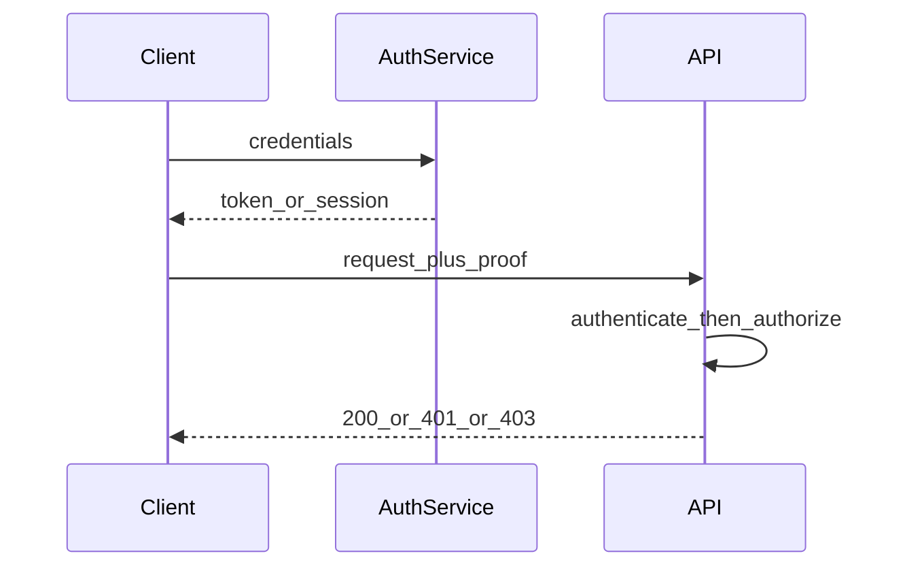

## Why this matters

Mixing “login” with “permissions” is a classic interview fail. Seniors design clear identity pipelines.

## Definitions

- **Authentication (AuthN):** Verifying a caller's identity—proving who they are via credentials such as a password, OTP, certificate, or federated login.
- **Authorization (AuthZ):** Deciding whether an authenticated (or anonymous) principal may perform a specific action on a resource.
- **Principal:** The identity attached to the request after AuthN (user, service account, or device).
- **Credential:** A secret or proof used to authenticate (password, API key, private key, OTP).
- **Claim:** A statement about a principal (roles, tenant id, email) used as input to AuthZ decisions.
- **Session / token:** Proof of prior AuthN carried on later requests (session cookie or bearer token).
- **401 vs 403:** **401** means unauthenticated or invalid credentials; **403** means authenticated but not permitted.


## Concept



| Status | Meaning |
|--------|---------|
| **401** | Not authenticated (or bad/missing credentials) |
| **403** | Authenticated but not allowed |

## Worked examples

```java
// Pseudocode filter order
authenticate(request);          // sets SecurityContext principal or 401
authorize(principal, action);   // 403 if denied
handler.handle(request);
```

```csharp
// ASP.NET: authentication middleware then authorization
app.UseAuthentication();
app.UseAuthorization();
// [Authorize(Roles = "Admin")] on endpoints
```

## Interview Q&A

- **Q:** Can you authorize without authenticating?
  **A:** Public resources yes; for user-specific AuthZ you need a principal (or treat as anonymous role).
- **Q:** Where do checks live?
  **A:** Gateway for coarse auth; service for resource-level AuthZ (never trust client-only checks).

## Pitfalls

- Returning 401 when it should be 403  
- AuthZ only in the UI  
- Logging raw credentials

## 60-second answer

“AuthN establishes who; AuthZ decides what they can do. I authenticate first, attach a principal with claims, then enforce permissions server-side and map failures to 401 vs 403 correctly.”

## Further study

- [OWASP Authentication Cheat Sheet](https://cheatsheetseries.owasp.org/cheatsheets/Authentication_Cheat_Sheet.html) — practical AuthN controls interviewers expect you to name.
- [OWASP Authorization Cheat Sheet](https://cheatsheetseries.owasp.org/cheatsheets/Authorization_Cheat_Sheet.html) — server-side AuthZ patterns and common failure modes.
- [Microsoft Learn: Authentication and authorization](https://learn.microsoft.com/en-us/aspnet/core/security/authentication/) — how ASP.NET Core wires AuthN then AuthZ.
- [OAuth 2.0](https://oauth.net/2/) — delegated authorization baseline for modern APIs.

## Practice prompts

1. Design login + me + admin-only endpoint status codes  
2. List claims you’d put on a B2B multi-tenant token  
3. Draw AuthN/AuthZ for a mobile app + API
