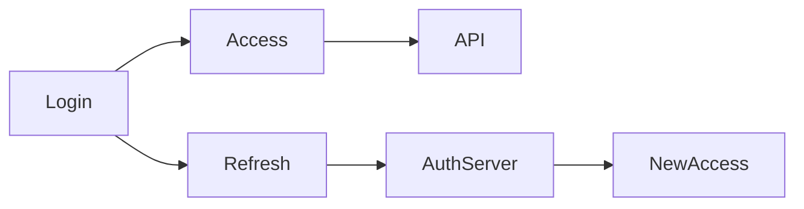

## Why this matters

JWTs are everywhere in interviews. Seniors must know validation rules, storage, and revocation trade-offs — not just “it’s a token”.

## Definitions

- **JWT (JSON Web Token):** Compact, URL-safe token of `header.payload.signature` (JWS) that carries claims a resource server can verify without a DB lookup.
- **Claim:** A name/value assertion in the payload (`sub`, `exp`, `iss`, `aud`, roles) used for identity and authorization.
- **JWS vs JWE:** **JWS** is signed (integrity/authenticity); **JWE** is encrypted (confidentiality). Most API “JWTs” are JWS.
- **Access token:** Short-lived credential presented to APIs; keep lifetime tight and validate on every request.
- **Refresh token:** Longer-lived credential used only at the auth server to mint new access tokens; store and revoke carefully.
- **Bearer token:** Possession equals authority—treat like a password; HTTPS and XSS defenses are mandatory.
- **JWKS:** JSON Web Key Set of public keys used to verify asymmetric signatures (RS256/ES256) and rotate via `kid`.


## Structure

```text
base64url(header).base64url(payload).base64url(signature)
header  = { "alg": "RS256", "typ": "JWT", "kid": "..." }
payload = { "sub": "user-1", "iss": "https://auth", "aud": "api", "exp": 1710000000, "roles": ["user"] }
```

## Validation checklist (say this)

1. Verify **signature** with the right key  
2. Check **exp** / **nbf**  
3. Check **iss** and **aud**  
4. Reject `alg=none` / algorithm confusion  
5. Optionally check `jti` denylist for revocation

```csharp
// ASP.NET JwtBearer options (conceptual)
options.TokenValidationParameters = new() {
  ValidateIssuer = true,
  ValidateAudience = true,
  ValidateLifetime = true,
  ValidateIssuerSigningKey = true,
  ValidIssuer = "https://auth.example",
  ValidAudience = "interviewtutor-api",
};
```

```java
// Spring Security Resource Server JWT (conceptual)
// spring.security.oauth2.resourceserver.jwt.jwk-set-uri=...
```

## Access + refresh pattern



- Access: minutes  
- Refresh: opaque, httpOnly cookie or secure store, rotatable, revocable in DB

## Interview Q&A

- **Q:** Store JWT in localStorage?
  **A:** XSS risk; prefer httpOnly Secure SameSite cookies for browsers when possible.
- **Q:** How to revoke JWT?
  **A:** Short TTL + refresh revocation; or denylist `jti`; or opaque reference tokens.
- **Q:** Symmetric vs asymmetric?
  **A:** HS256 shared secret; RS256/ES256 lets auth service sign and APIs verify via JWKS — better at scale.

## Pitfalls

- Huge JWTs stuffed with PII  
- No `aud` validation (token accepted by wrong API)  
- Long-lived access tokens without rotation  
- Trusting payload without verifying signature

## 60-second answer

“A JWT is a signed claims set. I validate sig, exp, iss, aud; keep access tokens short; use rotatable refresh tokens for sessions; and I’m careful about storage and revocation.”

## Further study

- [Introduction to JSON Web Tokens](https://jwt.io/introduction) — structure, claims, and common usage patterns.
- [RFC 7519: JSON Web Token (JWT)](https://www.rfc-editor.org/rfc/rfc7519) — normative claim names and processing rules.
- [OWASP JWT Cheat Sheet](https://cheatsheetseries.owasp.org/cheatsheets/JSON_Web_Token_for_Java_Cheat_Sheet.html) — validation pitfalls (alg confusion, none, key handling).
- [Microsoft Learn: JWT bearer authentication](https://learn.microsoft.com/en-us/aspnet/core/security/authentication/jwt-authn) — validating JWTs in ASP.NET Core.

## Practice prompts

1. Design refresh rotation with reuse detection  
2. List claims for multi-tenant SaaS  
3. Explain algorithm confusion attacks
