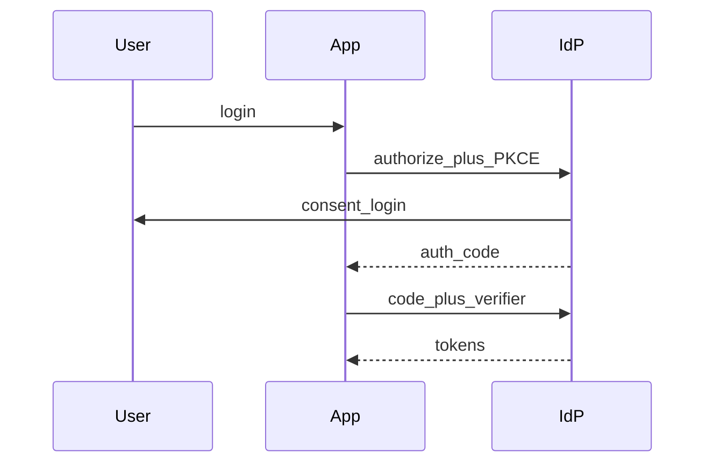

## Why this matters

Browser apps, mobile, and third-party login each need a different auth shape. Seniors pick flows deliberately.

## Definitions

- **Server session:** Server stores session state keyed by an opaque id; the client typically holds only that id in a cookie.
- **Cookie flags:** `HttpOnly`, `Secure`, and `SameSite` harden cookies against XSS theft, cleartext leaks, and many CSRF cases.
- **OAuth 2.0:** Delegated authorization protocol so a client gets limited access to resources without receiving the user's password.
- **OpenID Connect (OIDC):** Identity layer on OAuth 2.0 that adds ID tokens and userinfo for login/SSO.
- **Authorization Code + PKCE:** Recommended browser/mobile login flow; PKCE binds the code exchange to the original client.
- **CSRF:** Attacker site tricks the browser into sending the user's cookies on a forged request to your origin.
- **BFF (Backend-for-Frontend):** Server-side component that holds tokens/sessions so the SPA never stores refresh tokens in JS.


## Sessions vs JWT

| | Session cookie | JWT access token |
|--|----------------|------------------|
| Revoke | Delete server session | Harder (TTL/denylist) |
| Size | Small id | Larger claims |
| Scale | Need shared session store | Stateless verify |
| Browser | Natural fit | Cookie or memory |

## Cookie hardening

```text
Set-Cookie: sid=...; HttpOnly; Secure; SameSite=Lax; Path=/; Max-Age=...
```

## OAuth/OIDC sketch



## Interview Q&A

- **Q:** Why PKCE?
  **A:** Stops auth-code interception on public clients.
- **Q:** SameSite=None?
  **A:** Needs Secure; used for cross-site; CSRF design still required.
- **Q:** API-to-API?
  **A:** Client credentials grant; mTLS for high trust.

## Pitfalls

- Implicit flow in 2026 designs  
- Mixing session fixation without regenerating ids on login  
- Putting refresh tokens in localStorage

## 60-second answer

“Browsers often use secure session cookies or BFF-held tokens; OAuth/OIDC with auth code + PKCE for federated login. I harden cookies and pick flows by client type.”

## Further study

- [OAuth 2.0](https://oauth.net/2/) — grants, roles, and why implicit is obsolete.
- [How OpenID Connect Works](https://openid.net/developers/how-connect-works/) — ID tokens and login on top of OAuth.
- [MDN: Using HTTP cookies](https://developer.mozilla.org/en-US/docs/Web/HTTP/Cookies) — Secure, HttpOnly, SameSite behavior.
- [OWASP Session Management Cheat Sheet](https://cheatsheetseries.owasp.org/cheatsheets/Session_Management_Cheat_Sheet.html) — fixation, rotation, and cookie hardening.
- [Auth0: Authorization Code Flow with PKCE](https://auth0.com/docs/get-started/authentication-and-authorization-flow/authorization-code-flow-with-pkce) — why PKCE is the default for public clients.

## Practice prompts

1. Design “Login with Google” for an SPA + API  
2. Compare BFF pattern vs pure SPA bearer tokens  
3. CSRF defenses with cookie sessions
