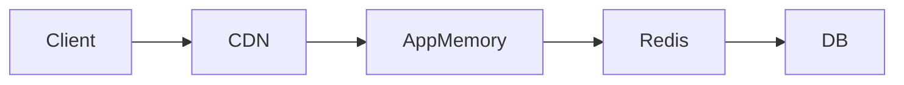

## Why this matters

Caching is the highest-leverage latency tool — and a top source of consistency bugs.

## Definitions

- **Cache:** Fast storage of previously computed or fetched data so repeated reads avoid expensive origin work.
- **Hit / miss:** A **hit** serves from cache; a **miss** requires loading from the origin (DB, API, disk).
- **TTL (time-to-live):** How long an entry may be served before it expires or is treated as stale.
- **Hit ratio:** Hits ÷ (hits + misses)—primary effectiveness metric when paired with latency and freshness SLOs.
- **Cache locality:** Where the cache lives—process memory, shared Redis, or CDN/edge—trading speed vs consistency and memory.
- **Thundering herd (stampede):** Many clients miss the same hot key at once and overload the origin.
- **Source of truth:** The authoritative store (usually the DB); caches are performance layers, not durable truth.

## Cache layers

| Layer | Good for |
|-------|----------|
| CDN/edge | Public static / cacheable GETs |
| Redis | Shared hot data across instances |
| In-process | Tiny ultra-hot objects (careful) |
| DB | Source of truth |

## When NOT to cache

- Highly personalized data without vary keys  
- Rarely read, write-heavy data  
- Data with strong immediate consistency needs (unless short TTL + invalidation)

## Interview Q&A

- **Q:** Aside vs through?
  **A:** Cache-aside (lazy) is the default interview answer; write-through keeps cache warm at write cost.
- **Q:** How long TTL?
  **A:** Based on staleness tolerance; pair with invalidation for correctness-critical data.

## Pitfalls

- Caching errors forever  
- Missing tenant/user in keys → leaks  
- Measuring only averages, not p99 after cache

## 60-second answer

“I cache expensive read paths with explicit TTLs and keys, pick the right layer, and treat the DB as truth. I design for misses, stampedes, and invalidation — not just happy-path hits.”

## Further study

- [Redis documentation](https://redis.io/docs/latest/) — shared cache primitives used in most backend interviews.
- [MDN: HTTP caching](https://developer.mozilla.org/en-US/docs/Web/HTTP/Caching) — Cache-Control, validators, and browser/CDN behavior.
- [AWS Caching Best Practices](https://aws.amazon.com/caching/best-practices/) — layering, TTLs, and invalidation trade-offs.
- [Microsoft Learn: Caching overview](https://learn.microsoft.com/en-us/azure/architecture/best-practices/caching) — when and where to cache in cloud systems.

## Practice prompts

1. Choose layers for product page + price  
2. Estimate Redis memory for 5M keys  
3. Decide TTL for permissions vs product descriptions
