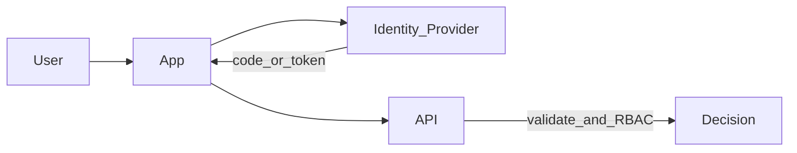

## Why this matters

Auth mistakes become data breaches. Senior interviews expect you to separate **authentication** (who you are) from **authorization** (what you can do), and to compare sessions vs JWT vs OAuth without hand-waving.

## Definitions

- **Authentication (AuthN):** Proving who the user or client is (identity).
- **Authorization (AuthZ):** Deciding whether that principal may perform an action on a resource.
- **Session:** Server-side (or opaque) login state, usually referenced by a secure cookie.
- **JWT:** Signed (optionally encrypted) token carrying claims; often used as a bearer access token — verify issuer/audience/exp.
- **OAuth 2.0:** Delegated authorization framework for limited access without sharing passwords.
- **OIDC:** Identity layer on OAuth 2.0 that standardizes login and ID tokens (use this for “login”, not raw OAuth alone).
- **PKCE:** Extension that protects public clients (SPAs/mobile) in the authorization-code flow from code interception.
- **RBAC / ABAC:** Role→permission maps vs attribute/policy-based decisions; always add object-level checks for multi-tenant data.

## Concept

| Term | Meaning |
|------|---------|
| **Authentication (AuthN)** | Prove identity |
| **Authorization (AuthZ)** | Permit an action on a resource |
| **Session** | Server-side (or opaque) login state |
| **JWT** | Signed claims token, often bearer |
| **OAuth 2.0** | Delegated authorization framework |
| **OIDC** | Identity layer on OAuth (login / ID token) |
| **RBAC** | Roles → permissions |
| **ABAC** | Attributes / policies (user, resource, context) |



## Worked example 1 — Server sessions

Flow:
1. User posts credentials  
2. Server validates → creates session id  
3. Store session in Redis/DB; send **HttpOnly Secure SameSite** cookie  
4. Each request loads session → user principal  

Pros: revocable instantly, smaller client tokens.  
Cons: sticky affinity or shared session store; CSRF considerations for cookie auth.

## Worked example 2 — JWT access tokens

```text
Header.Payload.Signature
payload: { sub, exp, iss, aud, roles, ... }
```

Rules to say in interviews:
- Prefer **short-lived access tokens** + refresh tokens  
- Validate `iss`, `aud`, `exp`, signature (JWKS)  
- Don’t put secrets/PII in JWT payloads  
- Logout / compromise needs a revocation story (short TTL, denylist, rotation)  

Java (Spring) sketch:

```java
@Bean
SecurityFilterChain filter(HttpSecurity http) throws Exception {
  http.authorizeHttpRequests(auth -> auth
      .requestMatchers("/admin/**").hasRole("ADMIN")
      .requestMatchers("/api/**").authenticated()
      .anyRequest().permitAll());
  http.oauth2ResourceServer(o -> o.jwt(Customizer.withDefaults()));
  return http.build();
}
```

C# sketch:

```csharp
builder.Services.AddAuthentication(JwtBearerDefaults.AuthenticationScheme)
    .AddJwtBearer(o =>
    {
        o.Authority = "https://idp.example";
        o.Audience = "api";
    });
builder.Services.AddAuthorization();
app.UseAuthentication();
app.UseAuthorization();
```

## Worked example 3 — OAuth2 / OIDC authorization code

For third-party login or API access on behalf of a user:

1. Redirect browser to IdP (authorization code + PKCE for public clients)  
2. User consents / authenticates  
3. App exchanges code for tokens at token endpoint  
4. Use access token for APIs; ID token for identity (OIDC)  

**Never** use implicit flow for new apps. Prefer **authorization code + PKCE**.

Service-to-service: client credentials grant (no user).

## Worked example 4 — RBAC vs finer AuthZ

```text
Role ADMIN → orders:read, orders:cancel, users:manage
Role SUPPORT → orders:read
Role CUSTOMER → orders:read:own
```

```java
// coarse
@PreAuthorize("hasRole('ADMIN')")
public void cancel(String orderId) { ... }

// ownership check still required for CUSTOMER
@PreAuthorize("hasRole('CUSTOMER')")
public Order getOwn(String orderId, Principal user) {
  Order o = repo.find(orderId);
  if (!o.ownerId().equals(user.getName())) throw new ForbiddenException();
  return o;
}
```

```csharp
[Authorize(Roles = "Admin")]
public IActionResult Cancel(string id) => ...;

// policy-based
options.AddPolicy("ManageOrder", p =>
    p.RequireAuthenticatedUser()
     .AddRequirements(new OrderOwnerOrAdminRequirement()));
```

Roles alone aren’t enough when the rule is “only your own order.” Add resource checks or ABAC/policies.

## Sessions vs JWT — pick deliberately

| Need | Lean toward |
|------|-------------|
| Instant revoke, simple web app | Server sessions |
| Stateless APIs, many services | JWT / opaque tokens via gateway |
| Third-party / social login | OIDC |
| Mobile + API | Short JWT + secure refresh storage |

Many systems combine: session cookie for the web BFF, JWT for APIs.

## Interview Q&A

- **Q:** JWT vs session?  
  **A:** Sessions are centrally revocable; JWTs scale statelessly but need short TTL/revocation strategy. Choose based on revoke needs and architecture.
- **Q:** Where do you store tokens in browsers?  
  **A:** Prefer HttpOnly cookies via BFF; avoid long-lived tokens in `localStorage` (XSS).
- **Q:** What is PKCE?  
  **A:** Proof Key for Code Exchange — stops auth-code interception on public clients.
- **Q:** RBAC vs ABAC?  
  **A:** RBAC maps roles→permissions; ABAC evaluates attributes/context for finer rules.
- **Q:** How do you authorize microservice calls?  
  **A:** mTLS and/or client credentials / token exchange; still enforce AuthZ in each sensitive service.
- **Q:** CSRF with cookie auth?  
  **A:** SameSite, anti-CSRF tokens, or separate non-cookie API tokens — know the threat.

## Pitfalls

- Trusting JWT payload without signature/`aud`/`iss` checks  
- Long-lived access tokens with no revoke plan  
- AuthZ only in the UI  
- Confused deputy / missing object-level authorization (IDOR)  
- Mixing “authenticated” with “allowed to see this row”  
- Logging tokens or putting secrets in JWTs  
- Using OAuth “for login” without OIDC understanding  

## 60-second answer

“AuthN proves identity; AuthZ enforces actions. I use OIDC authorization code with PKCE for user login, short-lived access tokens, and revocable sessions or refresh strategies. APIs validate issuer/audience/signature and apply RBAC plus object-level checks so customers can’t read others’ resources. Cookies are HttpOnly/Secure; I design for XSS/CSRF explicitly.”

## Further study

- [OAuth 2.0](https://oauth.net/2/) — canonical overview of the authorization framework
- [OpenID Connect](https://openid.net/developers/how-connect-works/) — how OIDC adds identity on top of OAuth
- [OWASP Top Ten](https://owasp.org/www-project-top-ten/) — authn/authz failures in the broader security landscape
- [Authentication Cheat Sheet](https://cheatsheetseries.owasp.org/cheatsheets/Authentication_Cheat_Sheet.html) — practical session/token hardening advice
- [RFC 7519 — JWT](https://datatracker.ietf.org/doc/html/rfc7519) — claims and token structure

## Practice prompts

1. Design login for a SPA + API using BFF cookies vs pure bearer tokens  
2. Add object-level AuthZ to GET `/orders/{id}`  
3. Explain how you’d revoke a stolen JWT in under a minute  
4. Compare client credentials vs user-delegated tokens for a billing worker
