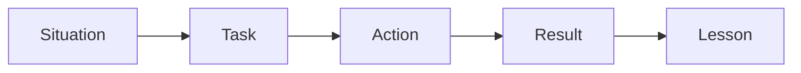

## Why this matters

At senior levels, behavioral rounds weigh as much as system design. Interviewers test **judgment, ownership, and influence** — not generic “I’m a team player” slogans. Structured stories win.

## Definitions

- **STAR:** Situation, Task, Action, Result — structured storytelling for behavioral interviews.
- **Ownership:** Clear responsibility for outcomes, communications, and follow-through — not only ticket completion.
- **Influence without authority:** Driving decisions/alignment across peers or teams without formal power.
- **Disagree and commit:** Argue the trade-off, then fully support the decided path once the team chooses.
- **Blameless postmortem mindset:** Focus on system factors and learning, not individual blame after failures.
- **Scope cut:** Intentionally reduce deliverables to protect quality, reliability, or a hard deadline.
- **Mentorship:** Raise others’ capability through coaching, feedback, and modeled practices — not only review comments.

## Concept

### STAR framework

| Letter | Meaning | Tip |
|--------|---------|-----|
| **S**ituation | Context, constraints, stakes | 2–3 sentences max |
| **T**ask | Your responsibility | “I owned…” not “we somehow…” |
| **A**ction | What *you* did | Specific decisions, trade-offs |
| **R**esult | Outcome + evidence | Metrics, dates, lessons |

Add **L**esson when useful: what you’d repeat or change.

### Senior themes to prepare (6–8 stories)

1. **Owned a production incident** end-to-end  
2. **Disagreed with a peer/manager** and influenced the outcome  
3. **Mentored / raised the bar** on the team  
4. **Delivered under ambiguity** (vague requirements)  
5. **Cut scope / said no** to protect quality or deadline  
6. **Technical debt** you paid down with business framing  
7. **Failed** (or nearly) and what changed after  
8. **Cross-team leadership** without formal authority  

Map each story to multiple questions (“conflict”, “leadership”, “failure”) so you can reuse flexibly.

## Worked example 1 — Incident ownership (STAR)

**S:** Checkout p99 jumped from 200ms to 2s during a sale; error rate 3%.  
**T:** I was primary oncall for the orders API.  
**A:** I declared an incident, rolled back a config flag, added a query projection to remove N+1, and posted customer-facing status updates every 15 minutes. After mitigation I wrote a postmortem with two action items: load test in CI and cache stampede protection.  
**R:** Recovered in 35 minutes; next sale held p99 < 300ms; postmortem actions closed in a week.  
**L:** Feature flags need load tests, not just unit tests.

## Worked example 2 — Conflict / influence

**S:** Product wanted a two-week “temporary” sync export that would lock our busiest table.  
**T:** I needed to protect reliability without stonewalling the launch.  
**A:** I quantified risk (lock time, last similar outage), proposed an async export with `202` + download link, and offered a thinner MVP for the sales demo. I aligned with the PM in writing on SLO impact.  
**R:** We shipped the async path three days later; demo succeeded; avoided peak-hour locks.  
**L:** Bring a cheaper alternative when you say no.

## Worked example 3 — Mentorship

**S:** Two mid-level engineers owned critical paths but skipped design reviews.  
**T:** As senior, I was asked to improve quality without becoming a bottleneck.  
**A:** I introduced a lightweight RFC template, paired on the first two designs, and rotated review ownership. I coached one engineer on breaking PRs into reviewable slices.  
**R:** Escape defects on that squad dropped next quarter; both later led designs solo.  
**L:** Process sticks when it’s short and modeled, not mandated in a wiki.

## Worked example 4 — Failure story

**S:** I pushed a migration that held a lock longer than expected in production.  
**T:** I owned the deploy.  
**A:** I halted the rollout, reversed, communicated impact, then redesigned as expand/contract with online backfill. I added a migration checklist to the team’s definition of done.  
**R:** No repeat lock incidents that year; checklist still used.  
**L:** I don’t treat schema changes as “just code.”

Keep failure stories **accountable** (your actions), not blame-shifting, and end with systemic improvement.

## Delivery tips

- Speak in **first person** for your actions; credit others for collaboration  
- Quantify: latency, $, users, time saved  
- Keep Situation short — interviewers care about Actions  
- Prepare 30s / 2min / 5min versions of each story  
- For “tell me about yourself”: present → past → future (role fit) in ~2 minutes  
- When stuck: ask clarifying scope, then structure aloud  

## Interview Q&A

- **Q:** Tell me about a conflict.  
  **A:** STAR with disagreement on approach, data you used, how you disagreed respectfully, outcome, relationship intact.
- **Q:** Leadership without authority?  
  **A:** Align on shared goal, make work visible, propose options with trade-offs, escalate with context not blame.
- **Q:** How do you prioritize?  
  **A:** User/business impact × risk × effort; make the cut explicit; revisit when facts change.
- **Q:** Strength / weakness?  
  **A:** Strength with proof story; weakness that’s real, mitigated, and not a core job requirement.
- **Q:** Why leaving / why us?  
  **A:** Pull factors: scope, mission, team — specific to their product.
- **Q:** Time you disagreed with your manager?  
  **A:** Commit after debate (disagree and commit) or escalate once with written trade-offs — show maturity either way.

## Pitfalls

- “We” stories with no clear personal actions  
- Rambling Situation for three minutes  
- No metrics or ending  
- Hidden blame / hero narrative without collaboration  
- Inventing stories — inconsistencies get probed  
- Claiming seniority without mentorship/incident/ownership examples  
- Being vague on conflict (“we talked and aligned”) with no trade-offs  

## 60-second answer

“I prepare 6–8 STAR stories covering incidents, conflict, mentorship, ambiguity, and failure. Situation is brief; Actions are mine and specific; Results are measured; I close with a lesson. Seniors show ownership and influence — I quantify impact and make trade-offs explicit.”

## Further study

- [STAR method (Wikipedia)](https://en.wikipedia.org/wiki/Situation%E2%80%93task%E2%80%93action%E2%80%93result) — structure for behavioral answers
- [Postmortem culture (SRE book)](https://sre.google/sre-book/postmortem-culture/) — blameless learning language seniors use
- [Amazon Leadership Principles](https://www.amazon.jobs/content/en/our-workplace/leadership-principles) — ownership/bias-for-action framing many interviews echo
- [Google Careers — how we hire](https://www.google.com/about/careers/applications/how-we-hire/) — how large tech firms structure interviews

## Practice prompts

1. Write STAR cards for incident, conflict, mentorship, failure  
2. Cut a 5-minute story to 90 seconds without losing Action/Result  
3. Answer “tell me about yourself” tailored to a job description  
4. Rehearse a disagree-and-commit story with a concrete trade-off table
