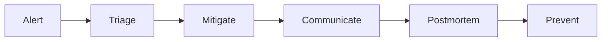

## Why this matters

Senior means you **own outcomes in production**, not just PRs. Interviewers ask about oncall, incidents, and tech debt to see if you’ve operated systems — and improved them after pain.

## Definitions

- **Oncall:** Responsibility to respond to production alerts and restore user-facing health within agreed response times.
- **Runbook:** Short playbook mapping symptoms → checks → mitigations → escalation paths.
- **Mitigation-first:** Restore service (rollback, flag off, shed load) before deep root-cause analysis during an incident.
- **Blameless postmortem:** Structured review focused on learning and preventive action items, not blame.
- **Blast radius:** How many users, regions, or features an incident affects — drives severity and comms.
- **Error budget:** SLO-derived allowance for unreliability that balances feature velocity vs reliability investment.
- **Tech debt portfolio:** Prioritize debt by risk/cost so fixes compete fairly with features (not a guilt list).

## Concept

Ownership = clarity on:

1. **What can break** (dependencies, SLOs)  
2. **How you know** (alerts, dashboards, traces)  
3. **What you do** (runbooks, rollback, comms)  
4. **How it gets better** (postmortems, debt paydown)  



## Worked example 1 — Oncall mindset

Good oncall hygiene:
- Alerts map to **user-visible symptoms** (error rate, latency, queue lag)  
- Every page has a **runbook** (symptoms → checks → mitigate → escalate)  
- Noise is a bug — fix flappy alerts  
- Know rollback / feature-flag kill switches **before** you need them  

When paged:
1. Acknowledge  
2. Assess blast radius (who/what %)  
3. Mitigate first (rollback, flag off, scale, shed load)  
4. Communicate early (status channel / stakeholders)  
5. Dig for root cause only after bleeding stops  

## Worked example 2 — Incident timeline (how to narrate)

**Detect:** p99 latency alert on checkout.  
**Triage:** traces show PaymentClient timeouts; dependency dashboard red.  
**Mitigate:** enable degraded mode (queue charges), raise timeout briefly, scale workers.  
**Comms:** post in #incidents + update partner.  
**Resolve:** dependency recovers; disable degraded mode.  
**Follow-up:** postmortem within 48h; action items with owners/dates.

Have one real story with numbers ready.

## Worked example 3 — Blameless postmortem structure

```text
Title / severity / duration
Impact (users, $, SLOs)
Timeline (UTC)
Root cause (technical + contributing factors)
What went well / poorly
Action items (prevent, detect, mitigate) — SMART owners
```

Blameless ≠ consequence-free for recklessness; it means optimize for **system learning**. Avoid “human error” as the root cause — ask why the system allowed it.

## Worked example 4 — Tech debt as a portfolio

Frame debt in business language:

| Debt | Risk | Cost to fix | Strategy |
|------|------|-------------|----------|
| N+1 on hot path | Latency / outages | 2 days | Fix now |
| Old library | Security | 1 week | Schedule this sprint |
| Messy module | Slow features | 3 weeks | Boy scout + strangler |
| Perfect rewrite fantasy | Distraction | ∞ | Don’t |

Tactics seniors use:
- **Boy scout rule** — leave touched code better  
- **Strangler fig** — replace edges incrementally  
- **Budget** — % capacity for reliability each sprint  
- **Error budgets** — freeze features when SLO burned  

```text
“If we don’t pay this down, every feature costs +30% and we page monthly.”
```

## Worked example 5 — Operability checklist for new services

- Structured logs + metrics + traces  
- Health/readiness probes  
- Safe deploys (rolling, canary, flags)  
- Migrations expand/contract  
- Ownership doc (pager, SLOs, dependencies)  
- Load test for critical paths  
- Data retention / backup / restore drill  

Shipping without these is incomplete.

## Interview Q&A

- **Q:** What do you do first when paged?  
  **A:** Mitigate user impact, then diagnose. Rollback/flag beats clever hotfixes under uncertainty.
- **Q:** How do you reduce pages?  
  **A:** Delete noisy alerts, improve SLOs/burn-rate alerts, fix top incident classes, add automation.
- **Q:** How do you prioritize tech debt?  
  **A:** Risk × frequency × cost to fix; attach debt to incidents and feature velocity loss.
- **Q:** Tell me about a postmortem.  
  **A:** STAR with impact, mitigation, root cause, and action items you owned to completion.
- **Q:** When do you rewrite?  
  **A:** Rarely — when boundaries are clear and incremental strangler can’t meet risk; prefer incremental.
- **Q:** How do you handle a dependency outage?  
  **A:** Timeouts, retries with backoff/jitter, circuit breakers, degraded UX, clear status communication.

## Pitfalls

- Debugging for an hour without mitigating  
- Alerts nobody understands  
- Postmortems with no owned actions  
- “We’ll rewrite it next quarter” without incremental plan  
- Hidden bus factor — only you understand the system  
- Equating ownership with heroics instead of systems/process  
- Ignoring customer communication during incidents  

## 60-second answer

“I own services through SLOs, alerts with runbooks, and safe rollbacks. In incidents I mitigate first, communicate, then find root cause. Postmortems are blameless with tracked actions. Tech debt is prioritized by risk to users and velocity, paid down with boy-scout changes, strangler replacements, and explicit reliability capacity — not big-bang rewrites.”

## Further study

- [Managing incidents (SRE book)](https://sre.google/sre-book/managing-incidents/) — roles, comms, and incident command basics
- [Postmortem culture (SRE book)](https://sre.google/sre-book/postmortem-culture/) — blameless reviews and action tracking
- [Incident response (SRE workbook)](https://sre.google/workbook/incident-response/) — practical oncall/response workflows
- [OWASP Top Ten](https://owasp.org/www-project-top-ten/) — security ownership themes that show up in production risk talks

## Practice prompts

1. Write a one-page runbook for “API error rate > 2%”  
2. Draft a blameless postmortem from a real or practice incident  
3. Build a debt backlog table with risk scores for your current team  
4. Explain expand/contract migrations with a concrete schema example
