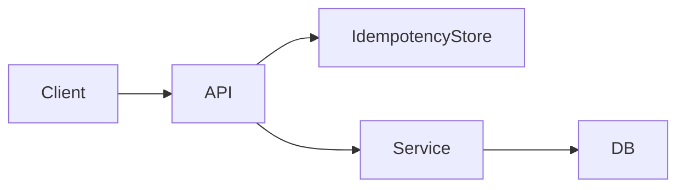

## Why this matters

Senior interviews don’t ask you to memorize HTTP verbs — they ask whether you can design APIs that survive retries, mobile clients, and five years of product change. Clear contracts beat clever ones.

## Definitions

- **Idempotency:** Repeating the same request has the same effect as doing it once — required for safe client retries.
- **Idempotency-Key:** Client-supplied unique key the server stores so duplicate retries return the original result, not a second side effect.
- **Resource-oriented API:** Endpoints centered on nouns/resources and standard verbs, not ad-hoc RPC action names alone.
- **Cursor pagination:** Opaque continuation token for stable, scalable paging (prefer over offset for large/changing feeds).
- **API versioning:** Evolution strategy (URL, header, or additive changes) that avoids breaking existing clients.
- **Error contract:** Stable, documented error shape (code, message, traceId) clients can parse across endpoints.
- **ETag / conditional request:** Version token so clients can detect concurrent updates (`If-Match` / `304`).

## Concept

Design around **resources and use-cases**, not internal tables.

Principles:
- Predictable URLs and verbs  
- **Idempotent writes** where clients retry  
- Stable error shapes  
- Explicit evolution (versioning / additive changes)  
- Pagination and filtering that scale  
- Authz at the edge of each sensitive operation  



### HTTP verb cheat sheet

| Verb | Idempotent? | Typical use |
|------|-------------|-------------|
| GET | Yes | Read |
| PUT | Yes | Replace / upsert by id |
| PATCH | Usually designed to be | Partial update |
| DELETE | Yes | Remove |
| POST | No (unless you make it) | Create / non-idempotent actions |

## Worked example 1 — Idempotent cancel

```http
PUT /orders/{id}/cancel
Idempotency-Key: 8f3c9e2a-...
Authorization: Bearer ...
```

Server behavior:
1. Look up key for this customer/operation  
2. Same key + same request → return original result  
3. Same key + different body → `409` conflict  
4. New key → perform cancel once, persist result  

Prevents double-charge / double-cancel when mobile retries.

Java sketch:

```java
@PutMapping("/{id}/cancel")
OrderDto cancel(@PathVariable String id,
                @RequestHeader("Idempotency-Key") String key) {
  return idempotency.execute(key, () -> orderService.cancel(id));
}
```

C# sketch:

```csharp
app.MapPut("/orders/{id}/cancel", async (string id, HttpRequest req, OrderService svc) =>
{
    var key = req.Headers["Idempotency-Key"].ToString();
    return await svc.CancelAsync(id, key, req.HttpContext.RequestAborted);
});
```

## Worked example 2 — Error contract

```json
{
  "code": "ORDER_NOT_CANCELABLE",
  "message": "Shipped orders cannot be canceled",
  "details": { "orderId": "A123", "status": "SHIPPED" },
  "traceId": "4bf92f3577b34da6a3ce929d0e0e4736"
}
```

Map domain outcomes to stable codes + appropriate HTTP status (`404`, `409`, `422`, `429`). Never leak stack traces or SQL.

## Worked example 3 — Pagination

**Offset** — simple admin UIs; suffers on deep pages.  
**Cursor** — large/realtime feeds; stable under inserts.

```http
GET /orders?customerId=42&limit=50&cursor=eyJpZCI6MTAwfQ
```

```json
{
  "items": [ ... ],
  "nextCursor": "eyJpZCI6NTB9"
}
```

## Worked example 4 — Versioning without pain

Prefer **additive evolution** first (new optional fields). When breaking:

- URL: `/v2/orders`  
- Or header: `Accept: application/vnd.company.order.v2+json`  

Document deprecation windows. Don’t break field meaning silently (“reuse” a field for something else).

## Consistency & concurrency

```http
GET /orders/A123
ETag: "W/\"3\""

PATCH /orders/A123
If-Match: "W/\"3\""
```

Optimistic concurrency prevents lost updates when two clients edit the same resource.

## Interview Q&A

- **Q:** POST vs PUT?  
  **A:** PUT replace/idempotent by known id; POST create or actions that aren’t naturally idempotent — add Idempotency-Key when clients retry.
- **Q:** When cursor over offset?  
  **A:** Large datasets, realtime feeds, or when offset drift under inserts/deletes hurts.
- **Q:** How do you version?  
  **A:** Additive first; explicit v2 when breaking; communicate sunset dates.
- **Q:** Sync vs async APIs?  
  **A:** Long work → `202 Accepted` + status resource / webhook; don’t hold HTTP for minutes.
- **Q:** Chatty APIs?  
  **A:** Offer batch endpoints or richer aggregates for mobile; don’t force 20 GETs for one screen.
- **Q:** Public vs internal APIs?  
  **A:** Public needs stricter stability, versioning, rate limits; internal can evolve faster with consumer contracts.

## Pitfalls

- Verbs in URLs without resource thinking (`/getOrder`) as the only style — RPCs can exist, but be intentional  
- Non-idempotent POSTs without retry keys for payments  
- Leaking internal exceptions  
- Unbounded list endpoints  
- Breaking changes without a version story  
- Authz checks only on UI, not API  
- Over-fetching sensitive fields by default

## 60-second answer

“I design resource-oriented APIs with clear status codes and a stable error shape including traceId. Writes that money or state depends on are idempotent — keys or natural PUT semantics. I page with cursors at scale, evolve additively when possible, and use ETags for concurrent updates. Long work returns 202 with a status resource.”

## Further study

- [API design best practices](https://learn.microsoft.com/en-us/azure/architecture/best-practices/api-design) — resource modeling, versioning, and pagination guidance
- [RFC 9110 — HTTP Semantics](https://www.rfc-editor.org/rfc/rfc9110.html) — methods, status codes, and idempotency rules
- [Stripe Idempotent Requests](https://docs.stripe.com/api/idempotent_requests) — production pattern for safe retries
- [OWASP API Security Top 10](https://owasp.org/www-project-api-security/) — common API failure modes interviewers probe

## Practice prompts

1. Design create-payment + webhook confirmation with idempotency  
2. Sketch cursor pagination for a feed with new inserts at the head  
3. Propose a v1→v2 migration that doesn’t strand mobile clients  
4. Define error codes for cancel-order domain failures
