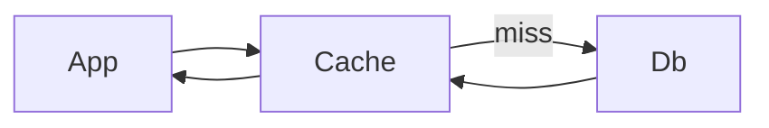

## Why this matters

Seniors own production behavior: latency under load and debuggability at 2am. Caching without invalidation is a bug farm; metrics without SLOs are vanity dashboards.

## Definitions

- **Cache-aside:** App reads cache first; on miss loads from DB, then populates cache with a TTL (lazy loading).
- **TTL (time to live):** How long a cache entry stays valid before expiry forces a refresh.
- **Cache stampede:** Many concurrent misses for one hot key hammer the origin after expiry — coalesce or serve stale.
- **SLI:** Quantitative indicator of user-visible health (latency, error rate, saturation).
- **SLO:** Target for an SLI that drives alerting, prioritization, and error budgets.
- **Error budget:** Allowed unreliability derived from an SLO — spent on change velocity vs reliability work.
- **Distributed tracing:** Correlated spans across services showing where latency and failures occur for one request.

## Concept

### Caching

Goal: serve hot reads cheaply without corrupting correctness.

**Cache-aside (lazy loading):**
1. Read cache  
2. On miss → read DB  
3. Populate cache with TTL  



Other patterns: read-through, write-through, write-behind — know trade-offs; cache-aside is the interview default.

### Observability pillars

| Pillar | Answers |
|--------|---------|
| **Logs** | What happened in this request? |
| **Metrics** | Is the system healthy over time? |
| **Traces** | Where did time go across services? |

Tie them with a **trace/correlation id**. Define **SLIs** (latency, error rate, saturation) and **SLOs** (target reliability) so alerts mean something.

## Worked example 1 — Cache-aside with TTL

Java:

```java
public Product getProduct(String id) {
  Product cached = redis.get(id);
  if (cached != null) return cached;

  Product p = db.find(id);
  if (p != null) redis.set(id, p, Duration.ofMinutes(5));
  return p;
}
```

C#:

```csharp
public async Task<Product?> GetAsync(string id, CancellationToken ct)
{
    var cached = await cache.GetStringAsync(id, ct);
    if (cached is not null) return JsonSerializer.Deserialize<Product>(cached);

    var p = await db.Products.AsNoTracking().FirstOrDefaultAsync(x => x.Id == id, ct);
    if (p is not null)
        await cache.SetStringAsync(id, JsonSerializer.Serialize(p),
            new DistributedCacheEntryOptions {
                AbsoluteExpirationRelativeToNow = TimeSpan.FromMinutes(5)
            }, ct);
    return p;
}
```

## Worked example 2 — Stampede protection

When a hot key expires, thousands of misses can crush the DB.

Mitigations:
- Singleflight / request coalescing (one refill in flight)  
- Soft TTL + probabilistic early refresh  
- Short locking around populate  
- Serve stale briefly while refreshing  

```text
if miss:
  if try_lock(key):
    load DB → set cache → unlock
  else:
    wait briefly / serve stale
```

## Worked example 3 — Invalidation

| Strategy | Notes |
|----------|-------|
| TTL only | Simple; temporary staleness OK |
| Explicit invalidate on write | Correctness-sensitive keys |
| Versioned keys | `product:v{n}:{id}` on schema/logic change |
| Cache-aside + pub/sub invalidate | Multi-instance coherence |

Never cache authorization decisions longer than safety allows. Don’t cache errors forever (negative caching needs short TTL).

## Worked example 4 — SLOs and alerts

Checkout example:
- SLI: successful checkout latency  
- SLO: 99% of checkouts `< 300ms` over 30 days; availability `99.9%`  

Alert on **burn rate** / symptom (error rate, latency) before paging on every CPU blip. Attach runbooks.

Golden signals: **latency, traffic, errors, saturation**.

## Worked example 5 — Structured telemetry

```text
log: { "level":"INFO", "msg":"order_created", "orderId":"A1", "traceId":"...", "customerId":"..." }
metric: order_create_latency_ms (histogram), order_create_total{status}
trace: API → OrderService → PaymentClient → DB spans
```

Java: Micrometer + OpenTelemetry.  
.NET: `Activity`, metrics meters, OpenTelemetry exporters.

## Interview Q&A

- **Q:** What SLOs for checkout?  
  **A:** Business-tied latency/availability targets (e.g. 99% < 300ms) with error budget thinking.
- **Q:** Cache stampede?  
  **A:** Many misses refill together — coalesce, lock, or early refresh; protect the DB.
- **Q:** Consistency with cache?  
  **A:** Accept TTL staleness or invalidate on write; for money paths, read-through to source of truth.
- **Q:** Logs vs metrics vs traces?  
  **A:** Events vs aggregates vs request journeys — you want all three correlated.
- **Q:** What makes a bad alert?  
  **A:** No user impact, no runbook, flappy thresholds — causes pager fatigue.
- **Q:** Where do you put caches?  
  **A:** Client, CDN, app memory, Redis — each layer needs TTL/invalidation ownership.

## Pitfalls

- Caching without TTL or invalidation plan  
- Caching personalized/sensitive data in shared keys  
- Negative cache forever  
- Dashboards without actionable alerts  
- High-cardinality metric labels (`userId` on every metric)  
- Logging PII unchecked  
- Measuring only averages — ignore p95/p99  

## 60-second answer

“I use cache-aside with explicit TTLs and a stampede story — coalesce or serve stale while refreshing. Writes invalidate or accept bounded staleness depending on the domain. Observability is logs, metrics, and traces linked by traceId, with SLIs/SLOs that drive alerts and error budgets — not CPU graphs alone.”

## Further study

- [Redis documentation](https://redis.io/docs/latest/) — cache data structures and operational primitives
- [OpenTelemetry docs](https://opentelemetry.io/docs/) — traces, metrics, and logs correlation standard
- [Monitoring distributed systems (SRE book)](https://sre.google/sre-book/monitoring-distributed-systems/) — golden signals and monitoring philosophy
- [Implementing SLOs (SRE workbook)](https://sre.google/workbook/implementing-slos/) — SLI/SLO/error-budget practice

## Practice prompts

1. Design caching for a product catalog + inventory counter (different freshness)  
2. Write a stampede-safe get-or-load pseudocode  
3. Define SLIs/SLOs/alerts for a login API  
4. Explain a production incident caused by caching errors or authz
